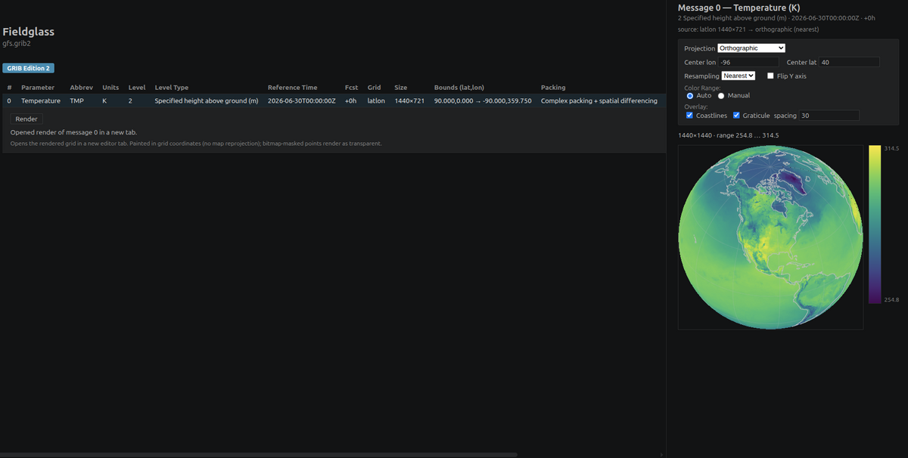

# Fieldglass

[](https://github.com/D0ubleD0uble/fieldglass/actions/workflows/ci.yml)
[](https://codecov.io/gh/D0ubleD0uble/fieldglass)
[](#license)

A Visual Studio Code extension for viewing meteorological data files (GRIB1, GRIB2, and NetCDF) right in the editor. It runs on a native Rust module and needs no extra dependencies to install. Fieldglass bundles a prebuilt binary for each supported platform and selects the right one automatically.



[Latest release](https://github.com/D0ubleD0uble/fieldglass/releases/latest)

## Status

This is an early public release (beta). For GRIB1, you can read every message's metadata and render its grid as a 2-D color image, either in the grid's own coordinates or reprojected onto a map. Five projection targets are available (source, equirectangular, Web Mercator, orthographic, and polar stereographic), and you can overlay coastlines and a latitude/longitude grid. GRIB2 reads metadata for every message and renders values for the packings it can decode. NetCDF reads the full structure of both classic files (CDF-1/2/5) and NetCDF-4 / HDF5 files — dimensions, variables, and global attributes — and decodes their variable values through the Rust API (for NetCDF-4 / HDF5: contiguous, compact, and chunked storage). For files on a regular lat/lon grid — classic or NetCDF-4 / HDF5 — you can render a 2-D slice of a variable: pick the variable and the image axes, step through the other dimensions (time, level), and use the same projection picker and overlays as GRIB. Still to come: rendering curvilinear and projected fields, value decode for more GRIB2 packings, and metadata editing. The [feature matrix](#feature-matrix) below shows exactly what works today.

## Feature matrix

| Feature | GRIB1 | GRIB2 | NetCDF |
|---|:---:|:---:|:---:|
| Format detection from magic bytes | ✅ | ✅ | ✅ |
| File-extension association (`.grb` / `.grib*` / `.nc*`) | ✅ | ✅ | ✅ |
| Open via *Reopen Editor With…* for unrecognized files | ✅ | ✅ | ✅ |
| Indicator / header section parsing | ✅ | ✅ | ✅ |
| Per-message metadata (parameter, level, time, forecast period) | ✅ | ✅ (§0–§4) | ✅ (dims / vars / attrs) |
| Grid description (lat/lon, Gaussian, polar stereo, Lambert) | ✅ | 🚧 lat/lon (3.0), rotated lat/lon (3.1), Mercator (3.10), polar stereo (3.20), Lambert (3.30), Gaussian (3.40), space view (3.90) | ❌ Not yet |
| WMO ON388 lookups (parameter, centre, level type) | ✅ | 🚧 Tables 0.0 / 1.2 / 1.3 / 1.4 / 3.1 / 3.2 / 4.1 / 4.2 / 4.3 / 4.4 / 4.5 / 4.6 / 4.10 + centres (subset) | n/a |
| Tabular metadata viewer | ✅ | ✅ (§0–§4) | ✅ |
| Binary data section decoding (Rust API) | ✅ | 🚧 partial — see [GRIB2 packing modes](#grib2-packing-modes) | 🚧 classic (CDF-1/2/5) + NetCDF-4 / HDF5 (contiguous, compact, and chunked storage with deflate / shuffle) |
| Metadata editing | ❌ Not yet | ❌ Not yet | ❌ Not yet |
| 2-D grid rendering with colormap | ✅ | 🚧 any decodable message (see decoding row) | 🚧 regular lat/lon grids (classic + NetCDF-4 / HDF5) |
| Render-panel projection picker (5 targets) | ✅ | ✅ (any decodable message) | 🚧 regular lat/lon |
| Coastline + lat/lon grid overlay | ✅ | ✅ (any decodable message) | 🚧 regular lat/lon |
| Resampling picker (nearest / bilinear) | ✅ | ✅ | 🚧 regular lat/lon |

Format-agnostic features:

- Hex and ASCII fallback view for files whose contents are not a recognized format. ✅
- Files without a recognized extension can still be opened through *Reopen Editor With… → Fieldglass Viewer*.

### GRIB1 packing modes

A GRIB1 file's BDS (Binary Data Section) flag bits select one of several packing schemes. Decoding (and therefore 2-D rendering) covers only some of them today; metadata and format detection do not depend on the packing mode and work on every file. For an unsupported variant, the decoder returns an error naming the eccodes-style `packingType`, so you can match it against [eccodes' definitions](https://confluence.ecmwf.int/display/ECC/Documentation).

| BDS packing | eccodes packingType | Decode | Notes |
|---|---|:---:|---|
| Simple grid-point packing | `grid_simple` | ✅ | The bulk of CMC, NCEP non-operational data, and pygrib sample sets. |
| Constant field (`bits_per_value = 0`) | `grid_simple` | ✅ | Special case of simple packing. |
| Second-order, no SPD | `grid_second_order_no_SPD` | ✅ | Decodes via the shared general-extended path (order 0). Cross-validated against eccodes 2.34 with a hand-built oracle fixture (eccodes won't *encode* this order but decodes it). |
| Second-order, SPD-1 | `grid_second_order_SPD1` | ✅ | Decodes via the shared general-extended path (order 1). Cross-validated against eccodes 2.34 with a hand-built oracle fixture. |
| Second-order, SPD-2 (ECMWF default) | `grid_second_order` | ✅ | Most common in ECMWF MARS-derived files. Cross-validated against eccodes 2.34. |
| Second-order, SPD-3 | `grid_second_order_SPD3` | ✅ | Cross-validated against eccodes 2.34 (re-encoded from the SPD-2 fixture), with and without boustrophedonic row ordering. |
| Second-order, row-by-row | `grid_second_order_row_by_row` | ✅ | Classic WMO layout: one group per row, per-row widths, no SPD. Cross-validated against eccodes 2.34 with a hand-built oracle fixture. |
| Second-order, constant width | `grid_second_order_constant_width` | ✅ | Classic WMO layout: explicit secondary bitmap + single shared width. Cross-validated against eccodes 2.34 with a hand-built oracle fixture. |
| Second-order, general (legacy) | `grid_second_order_general_grib1` | ✅ | Classic WMO layout: secondary-bitmap-delimited variable-length groups + per-group widths. Cross-validated against eccodes 2.34 with a hand-built oracle fixture. |
| IEEE 754 raw floats | `grid_ieee` | ✅ | Values stored verbatim as big-endian floats; 32-bit (`precision = 1`) and 64-bit (`precision = 2`). Cross-validated against eccodes 2.34. 128-bit (`precision = 3`) is unsupported; eccodes returns `NOT_IMPLEMENTED` for it too. |
| Matrix-of-values (scalar form) | `grid_simple_matrix` | ✅ | `matrixOfValues = 0`: a simple-packed body behind the matrix sub-header (what eccodes emits for `packingType=grid_simple_matrix`). Cross-validated against eccodes 2.34. |
| Matrix-of-values (true matrix) | `grid_simple_matrix` | ✅ | `matrixOfValues = 1`: an `NR×NC` matrix at every grid point, via secondary bitmaps. Decoded through `Grib1Reader::decode_matrix_message` (not a single 2-D field, so it bypasses the scalar path). eccodes 2.34 can neither encode nor decode this variant, so it's validated against the eccodes definition/accessor source + a hand-computed fixture rather than a `grib_get_data` oracle. |
| Spherical-harmonic coefficients | `spectral_simple` / `spectral_complex` | ❌ Planned | IFS analyses; needs an inverse Legendre transform. |
| JPEG 2000 / PNG | `grid_jpeg` / `grid_png` | ❌ n/a | Not defined for GRIB1 edition 1 (eccodes' `packingType` concept lists them only to avoid set-failures); no encoder and no obtainable fixture. Common in GRIB2, tracked there. |

### GRIB2 packing modes

A GRIB2 message's §5 Data Representation Section selects a packing template. Decoding (and therefore 2-D rendering, reprojection, and overlays — all of which run on the decoded field, not the packing) covers a growing subset; metadata and format detection work on every message regardless. An undecodable template returns an `UnsupportedSection` error naming it, so it never mis-decodes.

<!-- SINGLE SOURCE OF TRUTH for GRIB2 decode status. When a template starts
     (or stops) decoding, update THIS table and the CHANGELOG [Unreleased]
     section — nothing else in the README enumerates GRIB2 packings, so those
     two edits keep the whole document accurate. -->

| DRS template | eccodes packingType | Decode | Notes |
|---|---|:---:|---|
| 5.0 — simple grid-point | `grid_simple` | ✅ | The common case for NCEP / ECMWF fields. Constant fields (`bits_per_value = 0`) included. Cross-validated against eccodes 2.34. |
| 5.4 — IEEE floating point | `grid_ieee` | ✅ | Values stored verbatim as big-endian floats; 32-bit (`precision = 1`) and 64-bit (`precision = 2`). Cross-validated against eccodes 2.34. 128-bit (`precision = 3`) is unsupported, as in eccodes. |
| 5.2 — complex | `grid_complex` | ✅ | Group-split packing, the GRIB2 analogue of GRIB1 second-order. Decodes the common envelope: general group splitting with no inline missing values. Row-by-row splitting and inline missing-value management return `UnsupportedSection`. |
| 5.3 — complex + spatial differencing | `grid_complex_spatial_differencing` | ✅ | Complex packing with 1st- or 2nd-order spatial differencing (common in GFS). Same general-splitting / no-inline-missing envelope as 5.2. Cross-validated against eccodes 2.34. |
| 5.40 — JPEG 2000 | `grid_jpeg` | ❌ | Compressed; deferred — no production-ready pure-Rust decoder, and a C binding would break the C-free cross-platform bundle (see [codec strategy](docs/decisions/0001-grib2-compressed-packing-codecs.md)). Tracked in [#116](https://github.com/D0ubleD0uble/fieldglass/issues/116). |
| 5.41 — PNG | `grid_png` | ✅ | The integer grid is wrapped in a PNG image (decoded with the pure-Rust `png` crate); the simple-packing `R` / `E` / `D` transform then applies. Cross-validated against eccodes 2.34. |
| 5.42 — CCSDS / AEC | `grid_ccsds` | ✅ | The integer grid is wrapped in a CCSDS adaptive-entropy-coding (libaec-compatible) stream, decoded with the pure-Rust `rust-aec` crate; the simple-packing `R` / `E` / `D` transform then applies. Cross-validated against eccodes 2.34. |

## Known limitations

This is a beta. Things to be aware of:

- **No metadata editing in the viewer.** The Rust API has byte-level patching for the forecast period (P1) and the webview retains the full undo/redo wiring, but the editable affordance is hidden in beta until general PDS-field editing lands. For now Fieldglass is a read-only viewer.
- **Reprojection targets.** The projection picker offers five targets: source (the grid in its native shape), equirectangular, Web Mercator, orthographic, and polar stereographic, plus an optional coastline and lat/lon grid overlay. The globe-style targets take a free-form centre: orthographic recentres on any lon/lat, and polar stereographic takes either pole with an arbitrary central meridian. GRIB1 lat/lon, Gaussian, rotated lat/lon, reduced (quasi-regular) lat/lon and Gaussian, Lambert, and polar stereographic grids, and GRIB2 rotated lat/lon (§3.1), Mercator (§3.10), polar stereographic (§3.20), Lambert Conformal (§3.30), and space-view perspective (§3.90, geostationary) grids, all reproject into the flat (lat/lon-box) targets.
- **GRIB2: full §0–§7 parsing, value decode for several packings.** `.grb2` / `.grib2` files enumerate messages and show edition, discipline, total length, originating centre, reference time, production status, data type, parameter name, level, forecast time, and grid geometry (templates 3.0 / 3.1 / 3.10 / 3.20 / 3.30 / 3.40 / 3.90: regular lat/lon, rotated lat/lon, Mercator, polar stereographic, Lambert Conformal, regular and reduced Gaussian, and space-view perspective). Value decoding covers a growing subset of §5 packing templates — see the [GRIB2 packing modes](#grib2-packing-modes) table for the current status. A message whose template isn't decoded yet still parses to the section level; `decode_message_values` returns an `UnsupportedSection` error naming the template rather than mis-decoding.
- **NetCDF-4 / HDF5: structure traversal and value decode (Rust API).** Classic NetCDF (CDF-1 / CDF-2 / CDF-5) parses fully and renders dimensions, global attributes, and variables. For NetCDF-4 / HDF5 files, Fieldglass walks the HDF5 object-header tree — groups, datasets, dataspaces, datatypes, and attributes — resolves the dimension-scale convention into named dimensions and per-variable dimension lists, and surfaces the same dimensions / variables / global-attributes tables in the metadata viewer as the classic path. It also decodes a dataset's values through the Rust API: contiguous, compact, and chunked storage, the deflate and shuffle filters, and fill-value masking. Chunked datasets that use the newer version-4 chunk index (fixed / extensible array) are not read yet and report an unsupported-layout error rather than mis-decoding. Variables on a regular lat/lon grid render a 2-D slice through the same picker and projection pipeline as the classic path. Dimension resolution covers the root group; variables in nested groups and curvilinear / projected fields are a follow-up.
- **GRIB1 GDS coverage:** Lat/Lon, Gaussian, polar stereographic, Lambert Conformal, rotated/oblique lat/lon (`grid_type 10`), and reduced (quasi-regular) lat/lon and Gaussian grids are parsed and reproject; GDS-absent messages resolve the common predefined global grids (ON388 Table B grids 2, 3, 4). Stretched grids, oblique Mercator, and other predefined-grid numbers are not yet supported and render as `unsupported`.
- **Parameter table coverage:** WMO ON388 Table 2 (versions 1–3) plus ECMWF local tables 128 and 129 (centre 98), which cover the bulk of IFS / ERA5 fields. Other centres' local tables (and other ECMWF versions) still resolve as `Unknown`.
- **Large files:** the extension reads the whole file into memory via `vscode.workspace.fs.readFile` to keep remote/virtual workspaces working. Multi-GB GRIB archives are not the target use case yet.

## Installation

Pre-built binaries for all supported platforms are bundled inside a single `.vsix` package. The extension selects the correct binary at runtime based on the host platform and architecture.

Supported platforms:

- Linux x64 (glibc), Linux arm64 (glibc)
- macOS x64, macOS arm64
- Windows x64, Windows arm64

### macOS

1. Download the latest `fieldglass-x.y.z.vsix` from the [releases page](https://github.com/D0ubleD0uble/fieldglass/releases/latest).
2. Open VS Code, run "Extensions: Install from VSIX..." from the command palette, and select the downloaded file. Alternatively, from a terminal:
   ```sh
   code --install-extension fieldglass-x.y.z.vsix
   ```
3. Reload the VS Code window.

### Linux

1. Download the latest `fieldglass-x.y.z.vsix` from the [releases page](https://github.com/D0ubleD0uble/fieldglass/releases/latest).
2. Open VS Code, run "Extensions: Install from VSIX..." from the command palette, and select the downloaded file. Alternatively, from a terminal:
   ```sh
   code --install-extension fieldglass-x.y.z.vsix
   ```
3. Reload the VS Code window.

### Windows

1. Download the latest `fieldglass-x.y.z.vsix` from the [releases page](https://github.com/D0ubleD0uble/fieldglass/releases/latest).
2. Open VS Code, run "Extensions: Install from VSIX..." from the command palette, and select the downloaded file. Alternatively, from PowerShell or Command Prompt:
   ```powershell
   code --install-extension fieldglass-x.y.z.vsix
   ```
3. Reload the VS Code window.

## Usage

Open any file with a supported extension. VS Code will use Fieldglass as the default editor and render a metadata table for each message in the file. To open an unrecognized file, right-click the file in the Explorer and choose "Open With...", then select "Fieldglass Viewer".

## Development

### Prerequisites

- Rust (stable toolchain, edition 2024 — Rust 1.85 or newer)
- Node.js 22 or newer
- Python 3.10 or newer (only for the dev tooling — `pre-commit`, `semgrep`)
- Visual Studio Code 1.85 or newer

### Repository layout

| Path | Purpose |
|---|---|
| `crates/fieldglass-core` | Format-agnostic traits and shared metadata types. |
| `crates/fieldglass-grib1` | GRIB1 parser, organized by section (`is.rs`, `pds.rs`, `gds.rs`, `bds.rs`) and WMO table lookups (`tables.rs`). |
| `crates/fieldglass-grib2` | GRIB2 reader — full §0–§7 parsing, message enumeration, and value decoding for the §5 packing templates listed in the [GRIB2 packing modes](#grib2-packing-modes) table. Grid templates 3.0 / 3.1 / 3.10 / 3.20 / 3.30 / 3.40 / 3.90; product templates 4.0 / 4.8 / 4.11. |
| `crates/fieldglass-netcdf` | NetCDF reader — full classic (CDF-1/2/5) header parser and value decode; HDF5 / NetCDF-4 object-tree traversal and dataset value decode (contiguous / compact / chunked, deflate + shuffle). |
| `crates/fieldglass-napi` | Node.js bindings exposed via napi-rs. The only crate that knows about Node. |
| `extension/` | TypeScript VS Code extension. Registers a custom read-only editor and renders a webview. |

### Initial setup

```sh
git clone git@github.com:D0ubleD0uble/fieldglass.git
cd fieldglass
pipx install pre-commit              # or: pip install --user pre-commit
npm install                          # installs @napi-rs/cli and activates git hooks
```

The root `npm install` installs `@napi-rs/cli` (used to build the native module) and runs an `npm prepare` step that activates the repository's git hooks (see [Pre-commit hooks](#pre-commit-hooks) below). If `pre-commit` isn't on `PATH` the prepare step prints a hint and continues; you can install it later and re-run `npm install`.

### Building the native module

The compiled binary must be present in `extension/bin/` for the extension to load. From the repository root:

```sh
cd crates/fieldglass-napi
npx napi build --platform --release --output-dir ../../extension/bin
```

This produces a file such as `extension/bin/fieldglass.linux-x64-gnu.node` along with `extension/bin/index.d.ts`. Repeat after changing any Rust code.

### Building the extension

```sh
cd extension
npm install
npm run compile
```

For continuous compilation during development, run `npm run watch` instead.

### Running the extension

Open the repository in VS Code and press `F5`. An Extension Development Host window will launch with Fieldglass loaded. Open any supported file in that window to test changes.

### Tests

Run the full Rust test suite:

```sh
cargo test
```

Run tests for a single crate or a single test by name substring:

```sh
cargo test -p fieldglass-grib1
cargo test -p fieldglass-grib1 parse_pds
```

#### Extension integration tests

The TypeScript side has a small `@vscode/test-electron` suite that boots a
real VS Code extension host and exercises the editor + render-panel paths
end-to-end. The render-panel tests in particular round-trip a real
`gridReady` payload through `webview.postMessage` so the wire format
between the extension host and the webview is exercised under the same
serializer as production. Coverage spans all three primary file formats
(GRIB1 / GRIB2 render, NetCDF metadata) plus a regression test for the
Buffer-vs-Uint8Array wire-format constraint.

```sh
cd extension
npm test
```

Tests require a display; CI runs them under `xvfb-run -a npm test`.

#### eccodes reference snapshots

`fieldglass-grib2` cross-checks every bundled GRIB2 fixture against the
[`eccodes`](https://confluence.ecmwf.int/display/ECC) reference implementation
via JSON snapshots. The snapshots live next to each fixture as
`tests/fixtures/{name}.grib2.eccodes.ref.json` and are checked into git, so
the test (`crates/fieldglass-grib2/tests/eccodes_reference.rs`) has zero
runtime dependencies — it just compares our parser output to the stored
JSON, one curated WMO key at a time.

You only need `eccodes` when **regenerating** the snapshots, typically after
adding a fixture or upgrading the reference. Install it via your package
manager (Debian/Ubuntu: `apt install libeccodes-tools`; macOS:
`brew install eccodes`), then run:

```sh
python3 tools/regenerate-eccodes-snapshots.py
```

The script invokes `grib_dump -j` per fixture, filters down to the curated
subset of keys in `CURATED_KEYS`, and rewrites each snapshot. The diff is
human-reviewable in PRs. To grow coverage to a new WMO key, add it to both
`CURATED_KEYS` (in the script) and the dispatch match in
`tests/eccodes_reference.rs::assert_message_matches`, then re-run the script.

### Linting

```sh
cargo clippy --all-targets --workspace -- -D warnings
cargo fmt --all -- --check
```

The `fieldglass-napi` crate also enables `#![deny(clippy::all)]`, so warnings there are hard errors regardless.

### Pre-commit hooks

The repository uses the [`pre-commit`](https://pre-commit.com/) framework. Its config is at [`.pre-commit-config.yaml`](.pre-commit-config.yaml). The framework auto-fetches and isolates the pinned versions of `shellcheck`, `actionlint`, `gitleaks`, and `semgrep`, so you only need `pre-commit` itself plus the Rust + Node toolchains.

One-time setup (per clone):

```sh
pipx install pre-commit                # preferred — works everywhere
# or, on systems without pipx:
pip install --user pre-commit          # may need --break-system-packages on PEP 668 distros
# or, fully isolated venv:
python3 -m venv ~/.venvs/fieldglass && ~/.venvs/fieldglass/bin/pip install pre-commit

cd /path/to/fieldglass
npm install                            # auto-runs `pre-commit install --hook-type pre-commit --hook-type pre-push`
```

Optional but recommended (the hooks gracefully report-and-fail if missing):

```sh
cargo install --locked cargo-deny      # advisory / license / source policy
```

What runs:

| Stage | Hook | What it does |
|---|---|---|
| `pre-commit` | `cargo fmt --check`, `cargo clippy -- -D warnings`, `tsc --noEmit` | Fast lints — usually under 3 s on incremental builds. |
| `pre-commit` | `check-yaml`, `check-json`, `check-toml`, `end-of-file-fixer`, `trailing-whitespace`, `check-merge-conflict`, `check-added-large-files` | File-hygiene polish. |
| `pre-commit` | `shellcheck`, `actionlint`, `gitleaks` | Lint shell scripts, GitHub Actions YAML, and scan staged diff for secrets. |
| `pre-push` | `cargo test --workspace`, `cargo deny check`, `npm audit --omit=dev`, `semgrep scan` | Slower correctness + security checks. |

Bypass with `git commit --no-verify` / `git push --no-verify` when you really must — CI (below) runs the same checks at full strength regardless.

### Continuous integration

The `pre-commit` job in [`.github/workflows/ci.yml`](.github/workflows/ci.yml) installs the same toolchain (Rust, Node, Python, `cargo-deny`) and runs `pre-commit run --all-files` for both the commit and push stages — so local hooks and CI run *exactly* the same checks, no drift. A second job builds the native module and compiles the extension as a smoke test. Tagged versions matching `v*` trigger a release build that compiles the native module for all six supported targets, packages the `.vsix`, and publishes it to GitHub Releases.

### Security and static analysis

Three additional Tier-1 scanners run on every push and PR (results land in the repo's **Security** tab):

- **[Semgrep](https://semgrep.dev/)** SAST in [`.github/workflows/semgrep.yml`](.github/workflows/semgrep.yml) — pattern-based security rules across Rust + TypeScript (`p/default`, `p/security-audit`, `p/owasp-top-ten`, `p/rust`, `p/typescript`, `p/secrets`). The same scan also runs locally on `git push`.
- **[CodeQL](https://codeql.github.com/)** semantic analysis in [`.github/workflows/codeql.yml`](.github/workflows/codeql.yml) — JavaScript/TypeScript and Rust, with the `security-extended` query suite.
- **[Dependabot](https://docs.github.com/en/code-security/dependabot)** in [`.github/dependabot.yml`](.github/dependabot.yml) — weekly version + security update PRs across `cargo`, `npm` (extension + root), and `github-actions`.

The Semgrep and CodeQL workflows are gated on `github.event.repository.visibility == 'public'` because GitHub Code Scanning's SARIF upload requires either a public repo or GitHub Advanced Security. They sit dormant on private repos and self-activate the moment the repo is flipped public. Dependabot runs regardless of visibility.

## Adding a new GRIB metadata field

The same flow applies to either edition — only the source section module differs.

1. Parse the field in the relevant section module:
   - GRIB1 → `crates/fieldglass-grib1/src/{is,pds,gds,bds}.rs`
   - GRIB2 → `crates/fieldglass-grib2/src/{is,ids,lus,gds,pds,drs,bms,ds}.rs`
2. Expose the value on the section struct.
3. Populate it on `MessageMeta` in `crates/fieldglass-napi/src/lib.rs` (both `open_grib1` and `open_grib2` produce the same `MessageMeta` shape, so a new field usually lands in both paths).
4. Add the corresponding camelCase field to the `MessageMeta` interface in `extension/src/provider.ts`.
5. Render it in the webview table in the same file.

WMO ON388 / FM 92 lookup tables live in `crates/fieldglass-grib1/src/tables.rs` (GRIB1) and `crates/fieldglass-grib2/src/tables.rs` (GRIB2) — extend the tables there rather than hardcoding strings at the napi or TypeScript layer. ECMWF GRIB1 local parameter tables (128/129) are generated from eccodes into `tables_ecmwf.rs` by `tools/gen_ecmwf_tables.py` — regenerate that file rather than editing it by hand. The napi-rs bindings automatically convert `snake_case` Rust field names to `camelCase` TypeScript fields.

## License

Fieldglass is dual-licensed under either of:

- MIT License ([LICENSE-MIT](LICENSE-MIT) or <https://opensource.org/licenses/MIT>)
- Apache License, Version 2.0 ([LICENSE-APACHE](LICENSE-APACHE) or <https://www.apache.org/licenses/LICENSE-2.0>)

at your option.

Unless you explicitly state otherwise, any contribution intentionally submitted for inclusion in Fieldglass by you, as defined in the Apache-2.0 license, shall be dual-licensed as above, without any additional terms or conditions.
