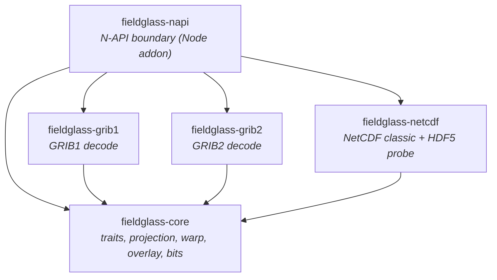

# Architecture — Level 1: crates

Five crates, one flow: a format crate parses its container and hands `core` the
same decoded field (`Vec<Option<f64>>` + grid geometry); `core` projects, warps,
and renders it; `napi` binds the result to Node. `fieldglass-core` owns the
shared traits and geometry and depends on nothing else in the workspace.
`fieldglass-napi` is the only crate that pulls in the format crates.

**Why it stays decoupled:** no format crate depends on another, and nothing
below `napi` depends on `napi`. A new decode path lands inside one format crate
and reuses `core`'s projection, warp, and overlay through the decoded field and
grid geometry, so it never ripples outward. Reprojection keys on grid type and
spacing alone, so a new field works the moment it decodes.
