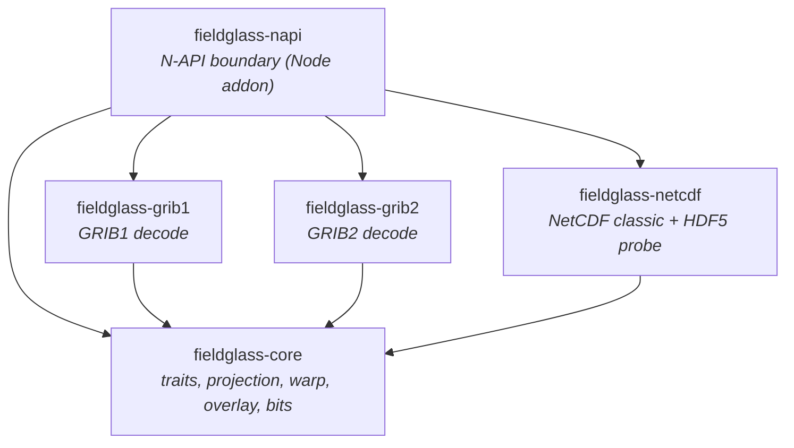

# Architecture — Level 1: crate dependency graph

The workspace is five crates. `fieldglass-core` defines the shared traits and
geometry; each format crate decodes one container and depends only on `core`;
`fieldglass-napi` is the Node/N-API boundary and is the only crate that depends
on the format crates.

**Why this shape holds (a decode invariant, not a coincidence):** no format
crate depends on another, and nothing below `napi` depends on `napi`. A new
decode path lands inside one format crate and reuses `core`'s projection / warp
/ overlay on the decoded `Vec<Option<f64>>` field + grid geometry — it does not
ripple outward. Reprojection eligibility keys on grid type and spacing only.
