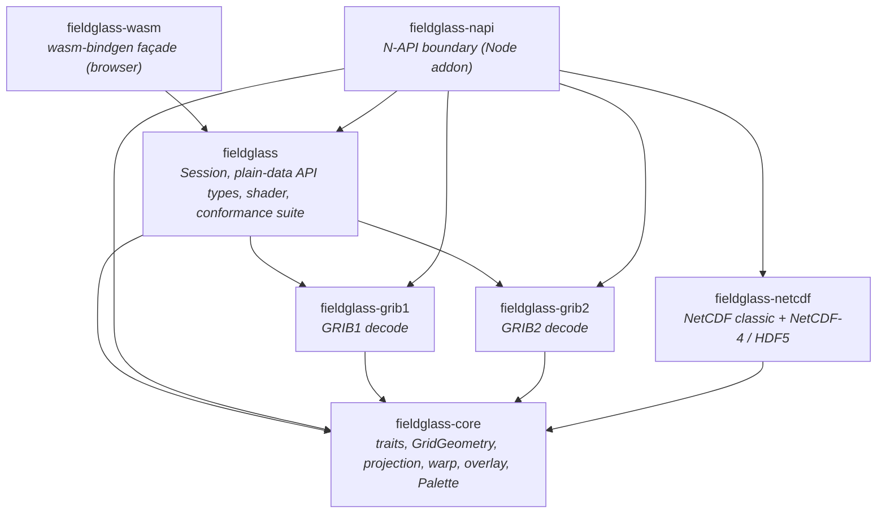

# Architecture — Level 1: crates

Seven crates, one flow: a format crate parses its container and hands `core` the
same decoded field (`Vec<Option<f64>>` + grid geometry); `core` projects, warps,
and renders it; a host binds the result to its language. `fieldglass-core` owns
the shared traits and geometry and depends on nothing else in the workspace.

Both hosts now bind `fieldglass`, the host-neutral umbrella, but they are
shaped differently and that is the one asymmetry worth knowing about.
`fieldglass-wasm` touches nothing below it. `fieldglass-napi` still reaches the
format crates directly as well: #572 moved the display half — warp, probe,
contours, overlays and CSV — onto `fieldglass`, and what is left below is
decode, NetCDF, and the `MessageMeta` DTO the VS Code extension still reads.
Closing that gap is the rest of
[#464](https://github.com/D0ubleD0uble/fieldglass/issues/464), under
[ADR-0006](../decisions/0006-hosts-are-bindings-over-a-plain-data-api.md).

```mermaid
flowchart TD
    napi["fieldglass-napi<br/><i>N-API boundary (Node addon)</i>"]
    wasm["fieldglass-wasm<br/><i>wasm-bindgen façade (browser)</i>"]
    fieldglass["fieldglass<br/><i>Session, plain-data API types, shader, conformance suite</i>"]
    grib1["fieldglass-grib1<br/><i>GRIB1 decode</i>"]
    grib2["fieldglass-grib2<br/><i>GRIB2 decode</i>"]
    netcdf["fieldglass-netcdf<br/><i>NetCDF classic + NetCDF-4 / HDF5</i>"]
    core["fieldglass-core<br/><i>traits, GridGeometry, projection, warp, overlay, Palette</i>"]

    wasm --> fieldglass
    fieldglass --> grib1
    fieldglass --> grib2
    fieldglass --> core
    napi --> fieldglass
    napi --> grib1
    napi --> grib2
    napi --> netcdf
    napi --> core
    grib1 --> core
    grib2 --> core
    netcdf --> core
```

**Why it stays decoupled:** no format crate depends on another, and nothing
below a host depends on a host. A new decode path lands inside one format crate
and reuses `core`'s projection, warp, and overlay through the decoded field and
grid geometry, so it never ripples outward. Reprojection keys on grid type and
spacing alone, so a new field works the moment it decodes.

**Why a format crate re-exports the `core` types it names.** Depending on
`fieldglass-grib1` alone has to be enough to *use* it, and every fallible call
it makes returns `fieldglass_core::FieldglassError`. If the crate does not
re-export that name, a consumer has to add `fieldglass-core` to their own
manifest to write a `match` — and a manifest line written for one type is
written without `default-features = false`, which unifies `render` and `fs`
back on for everything in the graph, the browser included. So each format crate
re-exports exactly the `core` names that appear in its own public signatures:
the error type; `GridGeometry` for the two GRIB crates' `From` impls;
`ByteRange` / `ByteSource` for NetCDF's byte-access seam; and, in `grib2`, the
three parameter structs a §3 template hands back by value
(`LambertAzimuthalParams`, `TransverseMercatorParams`, `GeostationaryParams`).
The rule is *its own signatures*, not "whatever seems useful" — a re-export of
something the crate does not itself hand back is core's API surface leaking
through a second door, and `GridGeometry`'s own payload structs are the line:
they are core's API, reached by destructuring rather than by name.
`tests/crate-independence` is a package that depends on the three format crates
and deliberately not on `core`, so the rule is checked by `cargo test
--workspace` rather than remembered. That package catches a re-export that is
*removed*; `tools/check_format_crate_reexports.py` (pre-commit) catches one that
is never *added*, by reading each crate's own public signatures — `pub fn`
headers, public fields, enum payloads, trait items and `impl … for …` headers,
which is how `GridGeometry` enters both GRIB crates — and asking whether every
`fieldglass_core` name in them can be spelled from the format crate alone. Its
`ALLOWED_UNEXPORTED` list is where an exception has to be written down.

**The conformance suite is part of the API, not of any host.** ADR-0006
decision 3 puts the fixtures and expected outputs in `fieldglass`, as data, and
has each host run its own binding through them; `crates/fieldglass/conformance/suite.json`
is that data and `fieldglass::conformance` (feature `conformance`, on by
default) is the runner's machinery — the case list, the observation each
operation produces, and the comparator. Three runners replay it:
`crates/fieldglass/tests/conformance.rs` over `Session` (native, and
`wasm32-wasip1` in CI), `fieldglass-napi`'s `conformance_host` module over the
napi handles, and `crates/fieldglass-wasm/tests/node/conformance.mjs` over the
built browser bundle from Node. The third is the one that exercises a
*binding's* own work — serde-wasm-bindgen conversion, the typed arrays, the
`e.code` error mapping — and it is a CI step in the wasm job, not a manual
check.

Two rules that follow from the same record are checked beside it.
`crates/fieldglass/tests/api_rules.rs` holds every public type in the API
modules to ADR-0006 decision 2 (no generics or lifetimes, contiguous values
plus a `u8` mask, `#[non_exhaustive]`, the serde and schema derives, a stated
`rename_all`), reading the crate's own source through `include_str!` so a type
added without being classified fails rather than going unchecked, and rejecting
a deliberately non-conforming type beside it so the gate is known to be
connected. `tools/check_host_types.py` (pre-commit) is the other half of #464's
acceptance — no function outside a host crate takes a host DTO or returns a
host error type — which Rust cannot assert from inside the crate that would
have the dependency.

**Why `fieldglass` takes `core` with `default-features = false`.** It sits
between every host and `core`, so taking core's defaults there would re-enable
them for the browser by feature unification, and the wasm bundle would carry
`detect_format`'s `std::fs` — dead weight on a target with no filesystem. It
names the two optional surfaces it does want, `render` and `analysis`, on the
dependency itself, and does not forward `fs` at all; ADR-0005 hands every host
bytes rather than a path. Turning those into the umbrella's own features, so a
host can decline one, is #552. `fieldglass` does not depend
on `fieldglass-netcdf` yet: NetCDF reaches the browser with its own issue, and
an unused dependency here would be paid for in bundle size today.

See [`planned/01-crates.md`](planned/01-crates.md) for where this is going —
`fieldglass-fetchplan` (#461), `fieldglass-zarr` (#246), and `napi` moving onto
`fieldglass` (#464).
