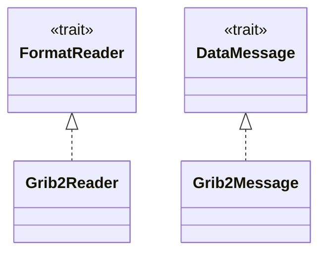
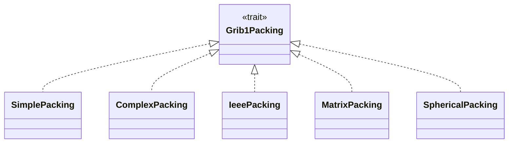
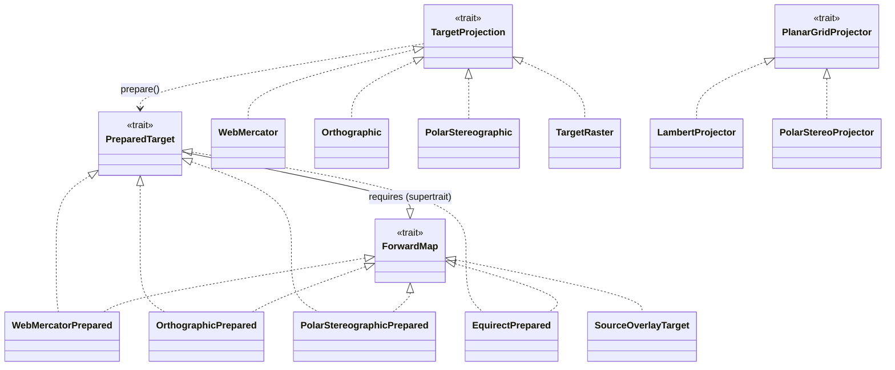

# Architecture — Level 2: trait seams

A reader can't know at compile time which packing or projection a file uses; the
file's own type codes decide. Each trait below is the dispatch point for one of
those choices. The reader reads a code, selects the matching implementer, and
calls through the trait, so supporting a new packing, projection, or output
raster takes one new implementer and nothing else.

In each diagram the implementers point at the trait they satisfy.

## Reading and decoding

`FormatReader` walks raw bytes into a sequence of messages; `DataMessage`
unpacks one message's values when asked. The scanner and the napi layer drive
both as trait objects, iterating and decoding without naming a concrete format.

## GRIB1 packing

The BDS flag byte names the packing. The reader matches it to one `Grib1Packing`
implementer, which unpacks the bit-stream into the common field of values. Each
implementer is one packing the decoder understands (GRIB2's equivalent set is
the README "packing modes" table).

## Projection and warp

`warp` reprojects a decoded field onto an output raster. It picks a
`TargetProjection`, calls `prepare()` once to build a `PreparedTarget`, then for
every output pixel uses `ForwardMap` to turn that pixel back into a source
lat/lon and sample the field. `PlanarGridProjector` runs the other direction,
mapping a lat/lon into a native grid's row and column. Overlays reuse the same
`ForwardMap` seam through `SourceOverlayTarget`.

> Authoritative source for the realizations above:
> `grep -rE 'impl( <[^>]+>)? [A-Za-z0-9_]+ for [A-Za-z0-9_]+' crates/*/src`.
> If that set changes, this file is stale; see `README.md` in this directory
> for the drift check.
