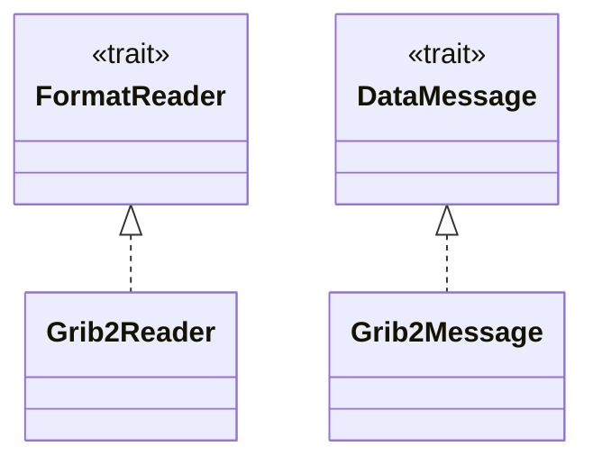
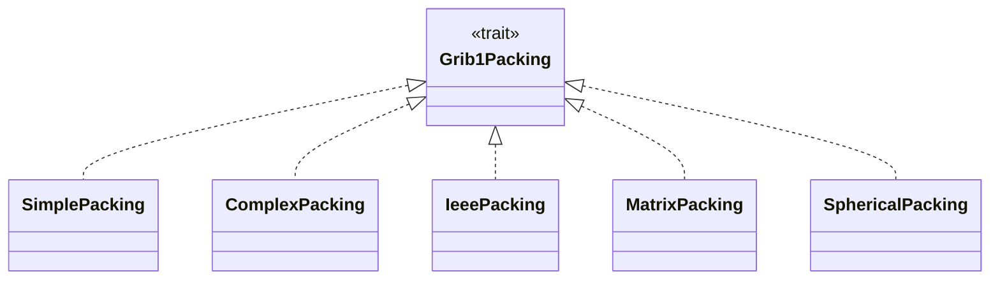
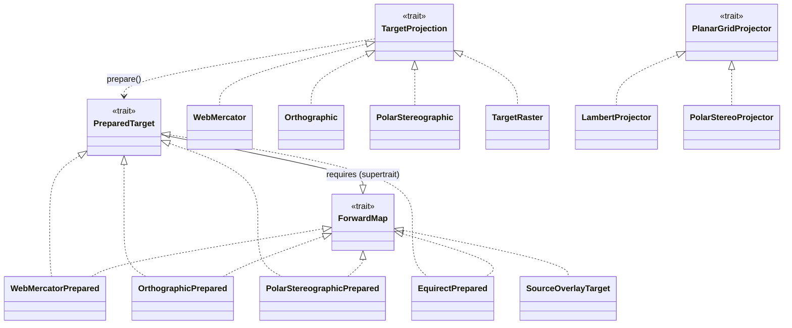

# Architecture — Level 2: trait seams (the extension points)

Rust has no classes; the closest analog to "an interface and its subclasses" is
a trait and the structs that implement it. These are the seams where the design
flexes — adding a packing, a projection, or a target raster means adding one
`impl` here. Dashed-with-hollow-triangle (`..|>`) is UML realization: *struct
implements trait*.

## core traits: reading and decoding

## GRIB1 packing family

The runtime-dispatched decoders. This is the GRIB1 analog of the README "GRIB2
packing modes" table — each variant the decoder understands is one `impl`.

## core projection & warp

`TargetProjection` describes an output raster and prepares a per-pixel
`PreparedTarget` / `ForwardMap`; `PlanarGridProjector` is the source-grid side
(map a lat/lon to grid indices). Overlays reuse the same `ForwardMap` seam via
`SourceOverlayTarget`.

> Authoritative source for the realizations above:
> `grep -rE 'impl( <[^>]+>)? [A-Za-z0-9_]+ for [A-Za-z0-9_]+' crates/*/src`.
> If that set changes, this file is stale — see `README.md` in this directory
> for the drift check.
