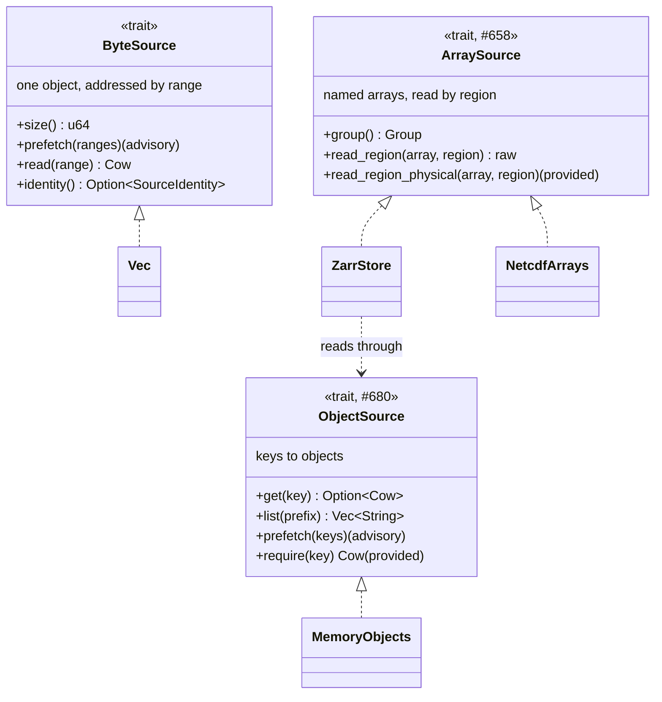
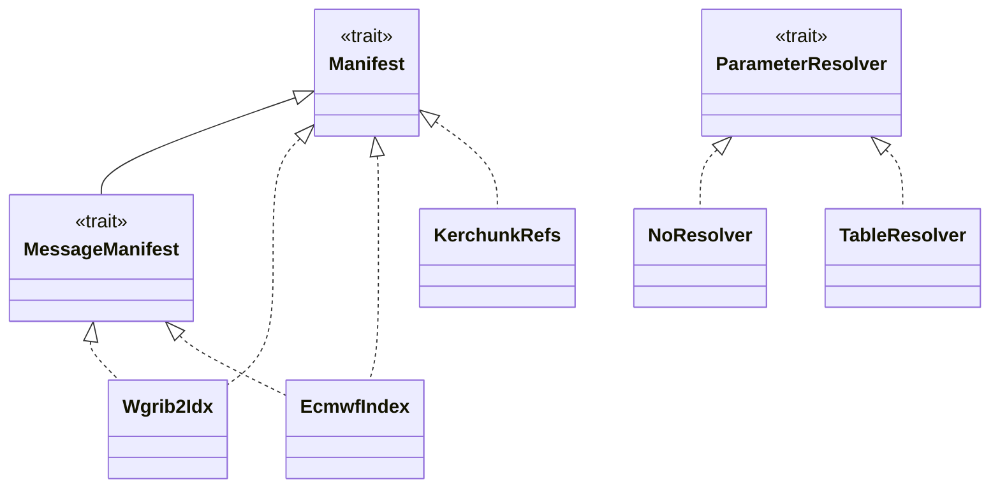
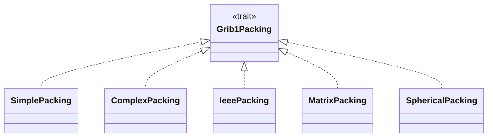
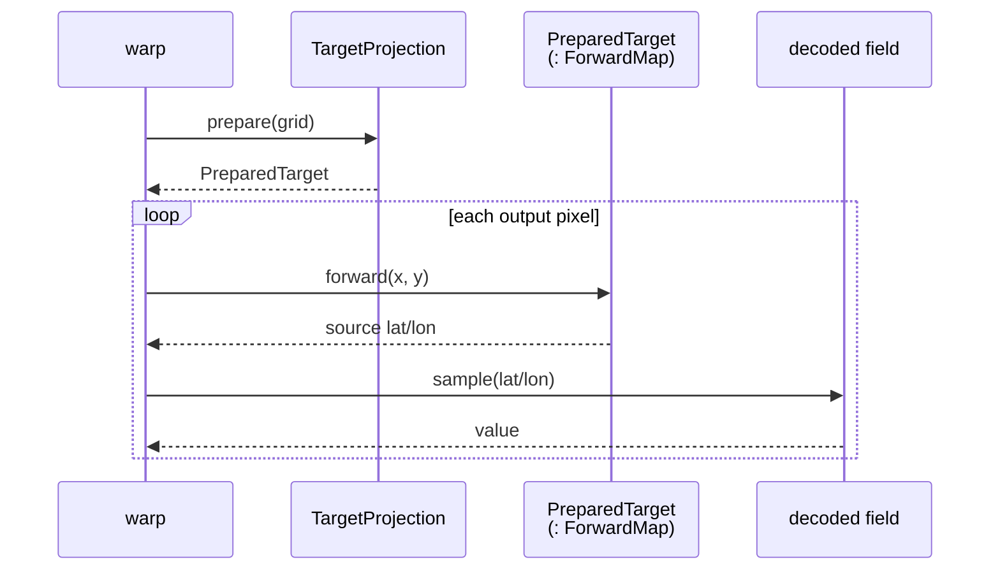

# Architecture — Level 2: trait seams

A reader can't know at compile time which packing or projection a file uses; the
file's own type codes decide. Each trait below is the dispatch point for one of
those choices: the code selects the implementer, and everything downstream calls
through the trait rather than naming the variant.

There is no trait over the readers themselves. Each format crate exposes a
concrete reader — `Grib1Reader`, `Grib2Reader`, `NetcdfReader` — and every
consumer names one: napi drives all three directly, and `Session` holds one per
open file ([ADR-0006](../decisions/0006-hosts-are-bindings-over-a-plain-data-api.md),
[`planned/03-composition.md`](planned/03-composition.md)). What used to sit here
was a pair of traits declaring every method without a receiver, so no
implementation of them could address a file; #540 deleted them along with the
two stub impls that satisfied them. If a reader seam is wanted later it gets
designed from the surface the consumers actually share.

In each diagram below the implementers point at the trait they satisfy.

## Byte access

`ByteSource` is where bytes come from ([ADR-0005](../decisions/0005-byte-access-and-the-remote-seam.md),
#438). Unlike the other seams here it does not dispatch on a code in the file —
it dispatches on where the file *is*. A reader resolves the ranges an operation
needs, prefetches them in one batch, and reads them back synchronously, so a
transport can be swapped underneath without any decoder learning it exists.

The implementers today are the byte buffers the readers already hold, which is
what makes the migration incremental: passing a `Vec<u8>` where a `ByteSource`
is wanted already works. HTTP range (#247) and object stores (#252) each add one
more.

**Both NetCDF readers are on it** — classic with #438, HDF5 with #682 — and the
two show the seam's range. Classic satisfies ADR-0005's *strong* form: every
offset is in the header, so `variable_plan` states a complete list of ranges
before a data byte is touched. HDF5 satisfies only the weak one, and the
architecture follows from that rather than from preference. Its traversal is a
chain of dependent reads — superblock, object header, group B-tree, fractal
heap, chunk index, each address inside the structure before it — so nothing can
be resolved up front and the walk prefetches nothing. The one place a real plan
exists is *after* the chunk index has been walked, and that is the one place
`prefetch` is called: a variable's stored bytes are one batch and then reads.

**So are both GRIB readers** (#697), and they sit between the two. Decode is
the strong form: a message's header records where its bitmap and data sit, so
each decode prefetches those sections in one batch and reads exactly them.
Finding the messages is the weak form: offset *N + 1* comes from message *N*'s
length field, and anything that is not the start of a message is stepped over
a byte at a time. The scan reads that search in growing windows
(`find_forward`) and each message's headers through one cursor bounded to the
message, so skipping padding, or a message of the other edition, costs a
handful of reads rather than one per byte. The cursor is the HDF5 reader's,
moved into `core` when the GRIB scan came to need the same thing. The readers
are generic over their source with `Vec<u8>` as the default, so `from_bytes`
callers do not change. `from_message_at` reads one message at a known offset
without scanning, which is the path a sidecar index's range takes.

Two consequences are worth naming because they are properties of the seam and
not of HDF5. A traversal reads fields, not structures, so a `read` per field
would be a round trip per integer; the HDF5 reader pulls a **growing window**
instead, which bounds both the round trips on a long structure and the
over-read on a short one. And a source may serve fewer bytes than it was asked
for — a buffer cannot, a truncated response can — so the length is checked at
the single point every read passes through, rather than at each caller that
would go on to index the result.

`identity()` is what a reader's memo keys on (ADR-0005 decision 2, #681). A
buffer identifies itself by where it begins and how far it runs; a source that
is not one contiguous buffer — a sparse map of prefetched ranges — gives the
name the host vouches for instead. A source that will not say answers `None`,
which is never reused for anything. It has to be stronger than length, because
length is not an identity: the HDF5 traversal memo keyed on it and served one
file's structure for another of the same size.

`ObjectSource` is its sibling, added by #680 under
[ADR-0010](../decisions/0010-a-common-array-model-and-containers-as-drivers.md).
`ByteSource` models **one object addressed by byte range** — a GRIB file, a
NetCDF file, an archive somebody range-fetches into. A great deal of data is not
shaped that way: a Zarr store is a key per chunk and per metadata document, a
directory is a key per file, a kerchunk document is a key per chunk pointing
into somebody else's object. They are siblings rather than one wrapping the
other, because a key-addressed store has no offsets to layer ranges over.

Two rules carry across, and they are what make a walker portable. `prefetch` is
**advisory** — a `get` works whether or not its key was prefetched, so the same
walker runs against a map, a directory and a bucket — and everything is
**synchronous**, because fetching is the host's (ADR-0005 decision 1). One rule
is new: an absent key answers `None` rather than erroring, because a sparse
array's missing chunk is its fill value and absence there is ordinary.
`require` is the other half, for a document whose absence really is a fault.

`MemoryObjects` is the in-memory implementation, and it records what was asked
of it: `tests/object_source.rs` asserts that a walk lists, prefetches **once**,
and then reads — which is the property a test that only checked the values
would miss, and the one an implementation loses first.

`ArraySource` is the rung above both (#658, ADR-0010's amendment to decision
3). The byte seams answer "give me these bytes"; this answers "give me this
array's values": a container's `Group` tree and a raw region read, with the CF
mask-and-scale applied once above it, from the array's own attributes, as
`read_region_physical`. It is a trait because it is IO — the model types it
returns stay plain structs. `ZarrStore` implements it over an `ObjectSource`,
and `NetcdfArrays` over the NetCDF reader's `ByteSource` (#704), which is where
Zarr belongs: a store is a layout of chunks under keys rather
than a file format, so it sits beside the NetCDF readers rather than beside
GRIB. A region read spells the chunk keys it covers from core, prefetches them
in one batch and then reads them, and `tests/stores.rs` holds it to exactly
that with `MemoryObjects`.

```mermaid
classDiagram
    class ByteSource {
        <<trait>>
        one object, addressed by range
        +size() u64
        +prefetch(ranges) (advisory)
        +read(range) Cow
        +identity() Option~SourceIdentity~
    }
    class ObjectSource {
        <<trait, #680>>
        keys to objects
        +get(key) Option~Cow~
        +list(prefix) Vec~String~
        +prefetch(keys) (advisory)
        +require(key) Cow (provided)
    }

    class ArraySource {
        <<trait, #658>>
        named arrays, read by region
        +group() Group
        +read_region(array, region) raw
        +read_region_physical(array, region) (provided)
    }

    ByteSource <|.. Vec
    ObjectSource <|.. MemoryObjects
    ArraySource <|.. ZarrStore
    ArraySource <|.. NetcdfArrays
    ZarrStore ..> ObjectSource : reads through
```

## Fetch planning

`Manifest` reads a cloud-native manifest and returns a chunk plan: which bytes
a host should fetch, and which chunk or message each range is
([ADR-0005](../decisions/0005-byte-access-and-the-remote-seam.md) decision 5,
#461; [ADR-0010](../decisions/0010-a-common-array-model-and-containers-as-drivers.md)
decision 4, #685). Like `ByteSource` it does not dispatch on a code inside a
file — it dispatches on which convention the *producer* publishes. `items()` is
the plan, and each `PlanItem` carries an `Address` beside its range: a message
and the field within it, or a chunk of an array by its grid index. `messages()`
is a provided method that collapses a message's fields onto one fetch, and it
recognises them by address rather than by range, so two chunks a reference
document points at the same bytes stay two chunks.

The two GRIB dialects differ in what they promise rather than in what they are
for: a wgrib2 `.idx` states an offset per message and no length, so its last
range is open-ended, while an ECMWF `.index` states both. Both are also
`MessageManifest`, the extension trait that answers a `Query` over parameters
and levels — which is GRIB's promise, not a manifest's.

`fieldglass-fetchplan` depends on no format crate, so resolving a sidecar's
`TMP` / `2 m above ground` to WMO codes — which needs the NCEP table in
`fieldglass-grib2` (#426) — is the second seam here. `NoResolver` is the
implementer for a purely syntactic query, and is what keeps the crate testable
without a table. `TableResolver` is the real one, in `fieldglass` under the
`fetchplan` feature: the parameter tables answer *codes to name*, so it inverts
them once into an index rather than scanning per record.

The kerchunk dialect landed with #660, and since #685 `KerchunkRefs` is a
`Manifest` and nothing more. A reference document names chunks of arrays
spread over as many objects as it likes and has no parameter to match, so a
request there is an index (`chunk_at`), and its plan names each ranged entry by
reading the key back through the array's own encoding
(`ChunkKeyEncoding::index_of`, in `core` beside the spelling it inverts). The
trait no longer carries the two promises that kept it out: `key()` is a method
on the two sidecar types, each of which describes one object, and the query is
`MessageManifest`'s.

```mermaid
classDiagram
    class Manifest {
        <<trait>>
    }
    class MessageManifest {
        <<trait>>
    }
    class ParameterResolver {
        <<trait>>
    }

    Manifest <|-- MessageManifest
    Manifest <|.. Wgrib2Idx
    Manifest <|.. EcmwfIndex
    Manifest <|.. KerchunkRefs
    MessageManifest <|.. Wgrib2Idx
    MessageManifest <|.. EcmwfIndex
    ParameterResolver <|.. NoResolver
    ParameterResolver <|.. TableResolver
```

## GRIB1 packing

The BDS flag byte names the packing. `decoder_for` matches it to one
`Grib1Packing` implementer, which unpacks the bit-stream into the common field
of values. Each implementer is one packing the decoder understands (GRIB2's
equivalent set is the README "packing modes" table).

The seam is internal, not an extension point: `decoder_for` is a closed
if/return chain over the flag bits inside `fieldglass-grib1`, and nothing
accepts a decoder from outside the crate. What the trait buys is that each
packing is a separate type with a separate test, and that adding one is a new
module plus a branch there rather than another case threaded through the shared
decode path.

```mermaid
classDiagram
    class Grib1Packing {
        <<trait>>
    }
    Grib1Packing <|.. SimplePacking
    Grib1Packing <|.. ComplexPacking
    Grib1Packing <|.. IeeePacking
    Grib1Packing <|.. MatrixPacking
    Grib1Packing <|.. SphericalPacking
```

## Projection and warp

`warp` reprojects a decoded field onto an output raster. Each `TargetProjection`
prepares a `PreparedTarget`, and a `PreparedTarget` is a `ForwardMap`: it turns
an output pixel back into a source lat/lon to sample. `PlanarGridProjector` runs
the inverse for native grids, mapping a lat/lon into a row and column. Overlays
reuse the `ForwardMap` seam through `SourceOverlayTarget`.

The implementers and the traits they satisfy:

```mermaid
classDiagram
    class TargetProjection {
        <<trait>>
    }
    class PreparedTarget {
        <<trait>>
    }
    class ForwardMap {
        <<trait>>
    }
    class PlanarGridProjector {
        <<trait>>
    }

    TargetProjection <|.. WebMercator
    TargetProjection <|.. Orthographic
    TargetProjection <|.. PolarStereographic
    TargetProjection <|.. Mollweide
    TargetProjection <|.. Robinson
    TargetProjection <|.. EqualEarth
    TargetProjection <|.. TargetRaster

    PreparedTarget <|.. WebMercatorPrepared
    PreparedTarget <|.. OrthographicPrepared
    PreparedTarget <|.. PolarStereographicPrepared
    PreparedTarget <|.. MollweidePrepared
    PreparedTarget <|.. RobinsonPrepared
    PreparedTarget <|.. EqualEarthPrepared
    PreparedTarget <|.. EquirectPrepared

    ForwardMap <|.. WebMercatorPrepared
    ForwardMap <|.. OrthographicPrepared
    ForwardMap <|.. PolarStereographicPrepared
    ForwardMap <|.. MollweidePrepared
    ForwardMap <|.. RobinsonPrepared
    ForwardMap <|.. EqualEarthPrepared
    ForwardMap <|.. EquirectPrepared
    ForwardMap <|.. SourceOverlayTarget

    PlanarGridProjector <|.. LambertProjector
    PlanarGridProjector <|.. PolarStereoProjector
    PlanarGridProjector <|.. TransverseMercatorProjector
    PlanarGridProjector <|.. LambertAzimuthalProjector

    PreparedTarget --|> ForwardMap : requires (supertrait)
```

The call order, where `prepare()` runs once per raster and `forward()` once per
output pixel:

```mermaid
sequenceDiagram
    participant W as warp
    participant P as TargetProjection
    participant T as PreparedTarget<br/>(: ForwardMap)
    participant F as decoded field
    W->>P: prepare(grid)
    P-->>W: PreparedTarget
    loop each output pixel
        W->>T: forward(x, y)
        T-->>W: source lat/lon
        W->>F: sample(lat/lon)
        F-->>W: value
    end
```

> Authoritative source for the realizations above:
> `grep -rE 'impl( <[^>]+>)? [A-Za-z0-9_]+ for [A-Za-z0-9_]+' crates/*/src`.
> If that set changes, this file is stale; see `README.md` in this directory
> for the drift check.
