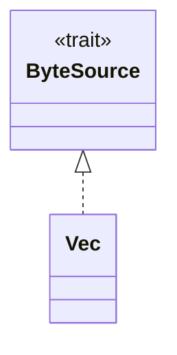
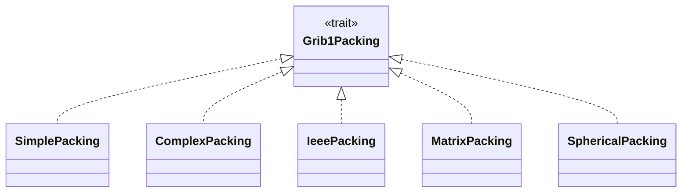
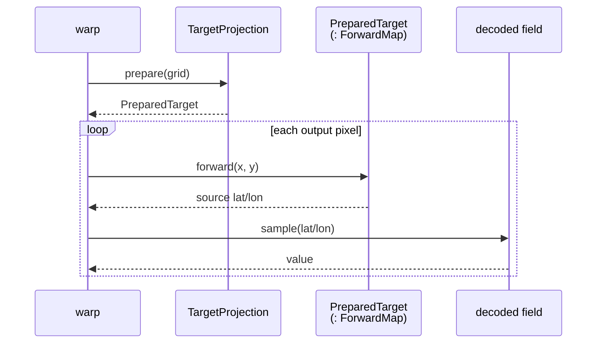

# Architecture — Level 2: trait seams

A reader can't know at compile time which packing or projection a file uses; the
file's own type codes decide. Each trait below is the dispatch point for one of
those choices: the code selects the implementer, and everything downstream calls
through the trait rather than naming the variant.

There is no trait over the readers themselves. Each format crate exposes a
concrete reader — `Grib1Reader`, `Grib2Reader`, `NetcdfReader` — and every
consumer names one: napi drives all three directly, and `Session` holds one per
open file ([ADR-0006](../decisions/0006-hosts-are-bindings-over-a-plain-data-api.md),
[`planned/03-composition.md`](planned/03-composition.md)). What used to sit here
was a pair of traits declaring every method without a receiver, so no
implementation of them could address a file; #540 deleted them along with the
two stub impls that satisfied them. If a reader seam is wanted later it gets
designed from the surface the consumers actually share.

In each diagram below the implementers point at the trait they satisfy.

## Byte access

`ByteSource` is where bytes come from ([ADR-0005](../decisions/0005-byte-access-and-the-remote-seam.md),
#438). Unlike the other seams here it does not dispatch on a code in the file —
it dispatches on where the file *is*. A reader resolves the ranges an operation
needs, prefetches them in one batch, and reads them back synchronously, so a
transport can be swapped underneath without any decoder learning it exists.

The implementers today are the byte buffers the readers already hold, which is
what makes the migration incremental: passing a `Vec<u8>` where a `ByteSource`
is wanted already works. HTTP range (#247), object stores (#252) and Zarr (#246)
each add one more.

```mermaid
classDiagram
    class ByteSource {
        <<trait>>
    }

    ByteSource <|.. Vec
```

## GRIB1 packing

The BDS flag byte names the packing. `decoder_for` matches it to one
`Grib1Packing` implementer, which unpacks the bit-stream into the common field
of values. Each implementer is one packing the decoder understands (GRIB2's
equivalent set is the README "packing modes" table).

The seam is internal, not an extension point: `decoder_for` is a closed
if/return chain over the flag bits inside `fieldglass-grib1`, and nothing
accepts a decoder from outside the crate. What the trait buys is that each
packing is a separate type with a separate test, and that adding one is a new
module plus a branch there rather than another case threaded through the shared
decode path.

```mermaid
classDiagram
    class Grib1Packing {
        <<trait>>
    }
    Grib1Packing <|.. SimplePacking
    Grib1Packing <|.. ComplexPacking
    Grib1Packing <|.. IeeePacking
    Grib1Packing <|.. MatrixPacking
    Grib1Packing <|.. SphericalPacking
```

## Projection and warp

`warp` reprojects a decoded field onto an output raster. Each `TargetProjection`
prepares a `PreparedTarget`, and a `PreparedTarget` is a `ForwardMap`: it turns
an output pixel back into a source lat/lon to sample. `PlanarGridProjector` runs
the inverse for native grids, mapping a lat/lon into a row and column. Overlays
reuse the `ForwardMap` seam through `SourceOverlayTarget`.

The implementers and the traits they satisfy:

```mermaid
classDiagram
    class TargetProjection {
        <<trait>>
    }
    class PreparedTarget {
        <<trait>>
    }
    class ForwardMap {
        <<trait>>
    }
    class PlanarGridProjector {
        <<trait>>
    }

    TargetProjection <|.. WebMercator
    TargetProjection <|.. Orthographic
    TargetProjection <|.. PolarStereographic
    TargetProjection <|.. Mollweide
    TargetProjection <|.. Robinson
    TargetProjection <|.. EqualEarth
    TargetProjection <|.. TargetRaster

    PreparedTarget <|.. WebMercatorPrepared
    PreparedTarget <|.. OrthographicPrepared
    PreparedTarget <|.. PolarStereographicPrepared
    PreparedTarget <|.. MollweidePrepared
    PreparedTarget <|.. RobinsonPrepared
    PreparedTarget <|.. EqualEarthPrepared
    PreparedTarget <|.. EquirectPrepared

    ForwardMap <|.. WebMercatorPrepared
    ForwardMap <|.. OrthographicPrepared
    ForwardMap <|.. PolarStereographicPrepared
    ForwardMap <|.. MollweidePrepared
    ForwardMap <|.. RobinsonPrepared
    ForwardMap <|.. EqualEarthPrepared
    ForwardMap <|.. EquirectPrepared
    ForwardMap <|.. SourceOverlayTarget

    PlanarGridProjector <|.. LambertProjector
    PlanarGridProjector <|.. PolarStereoProjector
    PlanarGridProjector <|.. TransverseMercatorProjector
    PlanarGridProjector <|.. LambertAzimuthalProjector

    PreparedTarget --|> ForwardMap : requires (supertrait)
```

The call order, where `prepare()` runs once per raster and `forward()` once per
output pixel:

```mermaid
sequenceDiagram
    participant W as warp
    participant P as TargetProjection
    participant T as PreparedTarget<br/>(: ForwardMap)
    participant F as decoded field
    W->>P: prepare(grid)
    P-->>W: PreparedTarget
    loop each output pixel
        W->>T: forward(x, y)
        T-->>W: source lat/lon
        W->>F: sample(lat/lon)
        F-->>W: value
    end
```

> Authoritative source for the realizations above:
> `grep -rE 'impl( <[^>]+>)? [A-Za-z0-9_]+ for [A-Za-z0-9_]+' crates/*/src`.
> If that set changes, this file is stale; see `README.md` in this directory
> for the drift check.
