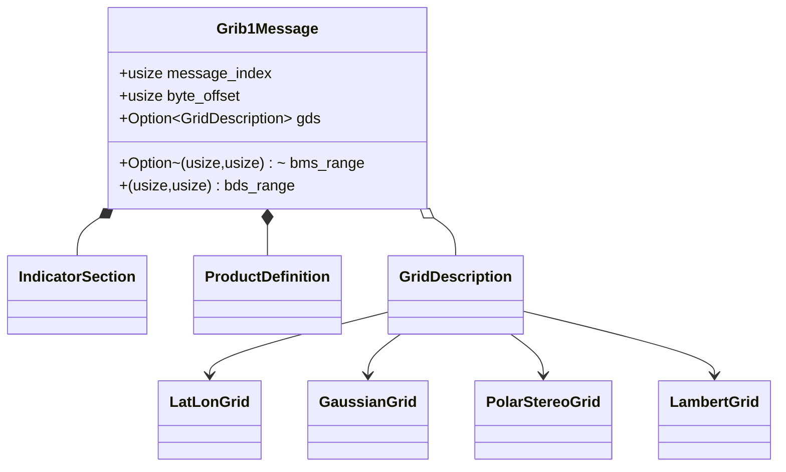
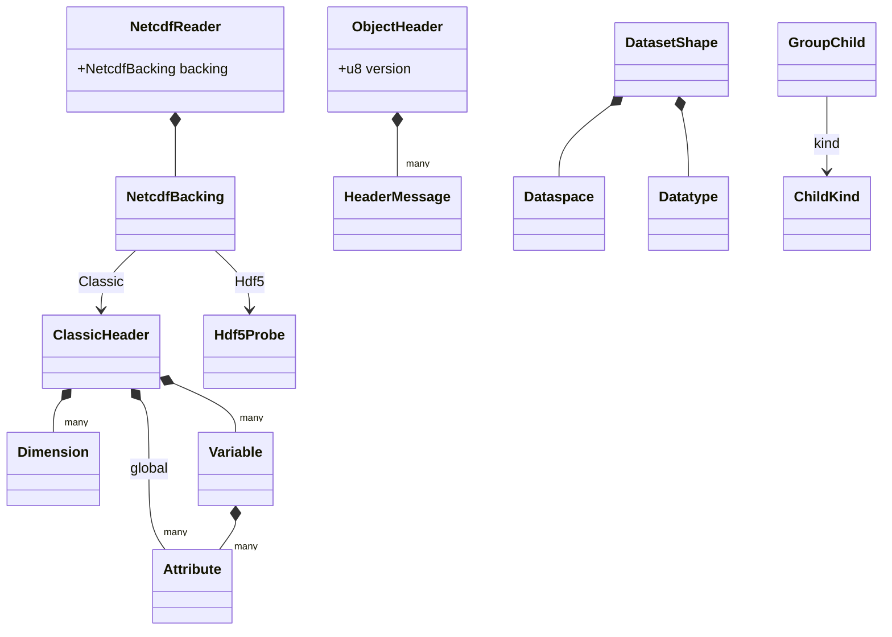
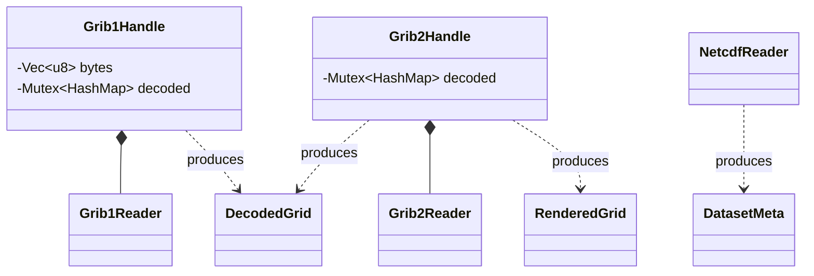

# Architecture — Level 3: composition (per format)

Each reader parses a file into one message that holds its sections. Where a
section's layout depends on a type code, the message carries a template enum and
the variant in hand is the one the code selected. Sections that are large or
optional stay as byte ranges and are decoded only when their values are asked
for, which keeps scanning a file cheap.

## GRIB2 message

One `Grib2Message` holds every WMO section. The grid, product, and
data-representation sections each carry a template enum that resolves to the
single concrete template the file declared.

```mermaid
classDiagram
    class Grib2Message {
        +usize message_index
        +usize byte_offset
        +Option~(usize,usize)~ lus_range
    }
    class GridDefinitionSection { +GridTemplate template }
    class ProductDefinitionSection { +ProductTemplate template }
    class DataRepresentationSection { +DataRepresentationTemplate template }

    Grib2Message *-- IndicatorSection
    Grib2Message *-- IdentificationSection
    Grib2Message *-- GridDefinitionSection
    Grib2Message *-- ProductDefinitionSection
    Grib2Message *-- DataRepresentationSection
    Grib2Message *-- BitMapSection

    GridTemplate <.. GridDefinitionSection
    ProductTemplate <.. ProductDefinitionSection
    DataRepresentationTemplate <.. DataRepresentationSection

    GridTemplate --> LatLonTemplate
    GridTemplate --> RotatedLatLonTemplate
    GridTemplate --> MercatorTemplate
    GridTemplate --> PolarStereographicTemplate
    GridTemplate --> LambertTemplate
    GridTemplate --> GaussianTemplate
    GridTemplate --> SpaceViewTemplate

    ProductTemplate --> Template40
    ProductTemplate --> Template48
    ProductTemplate --> Template411

    DataRepresentationTemplate --> SimplePackingTemplate
    DataRepresentationTemplate --> ComplexPackingTemplate
    DataRepresentationTemplate --> ComplexSpatialDiffTemplate
    DataRepresentationTemplate --> IeeePackingTemplate
```

## GRIB1 message

Flatter than GRIB2: the grid description is optional, and the bitmap and data
sections stay as byte ranges that `Grib1Reader` decodes on request.

## NetCDF reader

One reader over two on-disk layouts. Classic CDF is parsed fully up front. HDF5
(NetCDF-4) starts from a superblock probe and walks the object model
(`ObjectHeader` → messages → dataset shape) only as far as a request reaches.

## N-API boundary

Each handle wraps a format reader and a memoized decode cache, and hands
JavaScript plain metadata structs. Decoding a field caches it, so a second
request for the same field is free.

> Note: `IndicatorSection` appears in both the GRIB1 and GRIB2 sections above
> but they are **distinct types**, one per crate (`fieldglass-grib1` and
> `fieldglass-grib2`). The drift guard matches by base name and emits a warning
> about this so it isn't mistaken for a single shared type.
