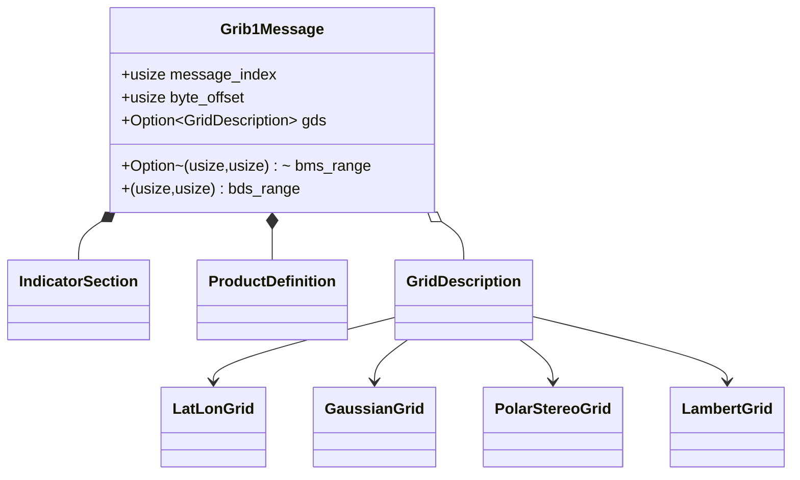
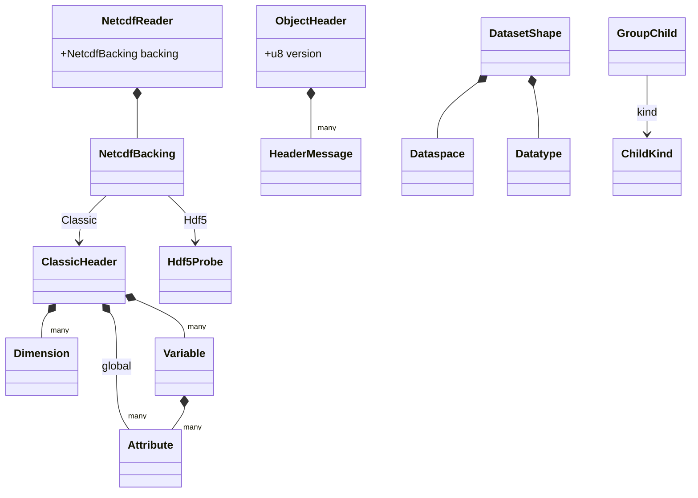
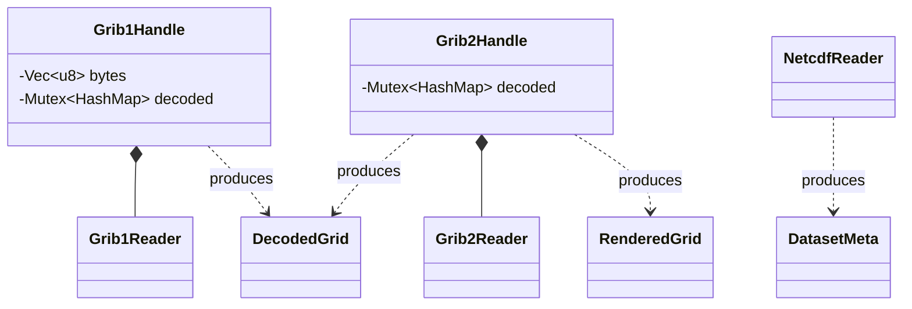

# Architecture — Level 3: data-type composition (per format)

How a decoded message is built from its parts. `*--` is UML composition
(owns-a); `-->` an enum-variant fan-out. Byte-range fields (`Option<(usize,
usize)>`) mark sections parsed lazily on demand rather than eagerly owned.

## GRIB2 message

A `Grib2Message` owns one of each WMO section; the grid, product, and data
representation sections each carry a template enum that fans out to the
concrete template structs.

```mermaid
classDiagram
    class Grib2Message {
        +usize message_index
        +usize byte_offset
        +Option~(usize,usize)~ lus_range
    }
    class GridDefinitionSection { +GridTemplate template }
    class ProductDefinitionSection { +ProductTemplate template }
    class DataRepresentationSection { +DataRepresentationTemplate template }

    Grib2Message *-- IndicatorSection
    Grib2Message *-- IdentificationSection
    Grib2Message *-- GridDefinitionSection
    Grib2Message *-- ProductDefinitionSection
    Grib2Message *-- DataRepresentationSection
    Grib2Message *-- BitMapSection

    GridTemplate <.. GridDefinitionSection
    ProductTemplate <.. ProductDefinitionSection
    DataRepresentationTemplate <.. DataRepresentationSection

    GridTemplate --> LatLonTemplate
    GridTemplate --> RotatedLatLonTemplate
    GridTemplate --> MercatorTemplate
    GridTemplate --> PolarStereographicTemplate
    GridTemplate --> LambertTemplate
    GridTemplate --> GaussianTemplate
    GridTemplate --> SpaceViewTemplate

    ProductTemplate --> Template40
    ProductTemplate --> Template48
    ProductTemplate --> Template411

    DataRepresentationTemplate --> SimplePackingTemplate
    DataRepresentationTemplate --> ComplexPackingTemplate
    DataRepresentationTemplate --> ComplexSpatialDiffTemplate
    DataRepresentationTemplate --> IeeePackingTemplate
```

## GRIB1 message

Flatter than GRIB2: the GDS is optional, and the bitmap / data sections are held
as byte ranges decoded on demand by `Grib1Reader`.

## NetCDF reader

One reader, two backings. Classic CDF is fully parsed at the header level; HDF5
(NetCDF-4) currently surfaces a superblock probe, with the deep HDF5 object
model (`ObjectHeader` → messages → dataset shape) parsed on traversal.

## N-API boundary

The handle structs wrap a format reader plus a memoized decode cache and expose
plain metadata structs to JavaScript (napi-rs renders `snake_case` →
`camelCase`).

> Note: `IndicatorSection` appears in both the GRIB1 and GRIB2 sections above
> but they are **distinct types**, one per crate (`fieldglass-grib1` and
> `fieldglass-grib2`). The drift guard matches by base name and emits a warning
> about this so it isn't mistaken for a single shared type.
