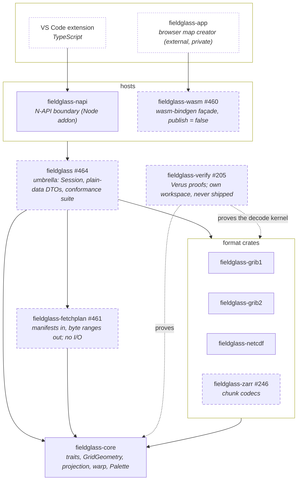

# Planned — Level 1: crates

After milestones 7, 10, and 11. Compare with [`../01-crates.md`](../01-crates.md).

Two hosts instead of one, an umbrella crate between them and the engine, and
two new pure crates. The rule from today's diagram survives unchanged: no
format crate depends on another, and nothing below a host depends on a host.
What changes is that a host no longer touches the format crates at all: it
binds `fieldglass`'s `Session` ([ADR-0006](../../decisions/0006-hosts-are-bindings-over-a-plain-data-api.md), #464).

Edges into or out of a box apply to every crate in it: `fieldglass` depends
on all four format crates, on `core`, and on `fetchplan`; each format crate
depends on `core` and on no other format crate; each host depends on
`fieldglass` only, and reaches fetch planning through it.

**What each new crate is for**

| Crate | Milestone | Depends on | Why it is its own crate |
| --- | --- | --- | --- |
| `fieldglass` | 11 | format crates, `core`, `fetchplan` | The umbrella and public Rust API (ADR-0006): `Session`, the plain serde-derivable DTOs, `Error`, the fetch-plan surface, and the conformance fixtures every host runs. |
| `fieldglass-wasm` | 11 | `fieldglass` | A cdylib for `wasm32-unknown-unknown`; buffer handoff and error mapping only. The host owns memory and fetching. |
| `fieldglass-fetchplan` | 11 | `core` | Pure: reads `.idx` / `.index` / Zarr / kerchunk manifests and returns ranges. No I/O, no clock, no format crate: parameter-level matching goes through a `ParameterResolver` trait the umbrella implements with grib2's tables (#426), so this crate stays syntax only. |
| `fieldglass-zarr` | 11 (re-scoped) | `core` | Chunk codecs only (zstd via `ruzstd`, blosc, shuffle, v3 shard inner chunks). Addressing lives in `fetchplan`; directory walking is the napi host's concern. |
| `fieldglass-verify` | 7 | `vstd` only; reads the kernel sources | Deliberately outside the workspace so `cargo build`, `cargo deny`, and the six-target cross-compile never see Verus. Already exists (#197); the proofs (#199–#204) are what is planned. |

**Features do not stop at a crate boundary.** `core`'s optional surfaces are
off for a host that cannot use them only if every crate between the host and
`core` says so. `fieldglass` must therefore take `core` with
`default-features = false` and re-export `render` and `fs` as its own features.
`fieldglass-napi` needs `render`; neither host needs `fs`, because ADR-0005
hands both of them bytes rather than a path — it is there for a Rust, CLI
(#254) or PyO3 consumer that starts from one. Taking
`core`'s defaults in the umbrella instead would re-enable them by feature
unification, and the wasm build would carry `detect_format`'s `std::fs` — dead
weight against #462's bundle-size gate, and no gate at all. `GridGeometry` is
the counter-case and is why it sits in the always-on `projection` module
(ADR-0006): a format crate taking `core` with `default-features = false` has to
be able to convert into it.

**What moves.** `core` grows the `GridGeometry` enum; the render
orchestration (`ResolvedOptions`, warp targets, probe, contour and overlay
projection, CSV) that today sits in `napi` becomes `fieldglass::Session`
(#464). `napi` and `wasm` keep buffer conversion and error mapping, with
their DTOs derived from the API types. That is the one structural change;
everything else is additive.

**What does not appear.** HTTP range (#247) and S3 (#252) are not crates: per
ADR-0005 the host fetches, so in the browser they are `fetch()` with a `Range`
header driven by `fetchplan`'s output, and in the extension they will be the
same call from TypeScript. `#114` (multi-GB files) is the same seam applied to
a local file.
