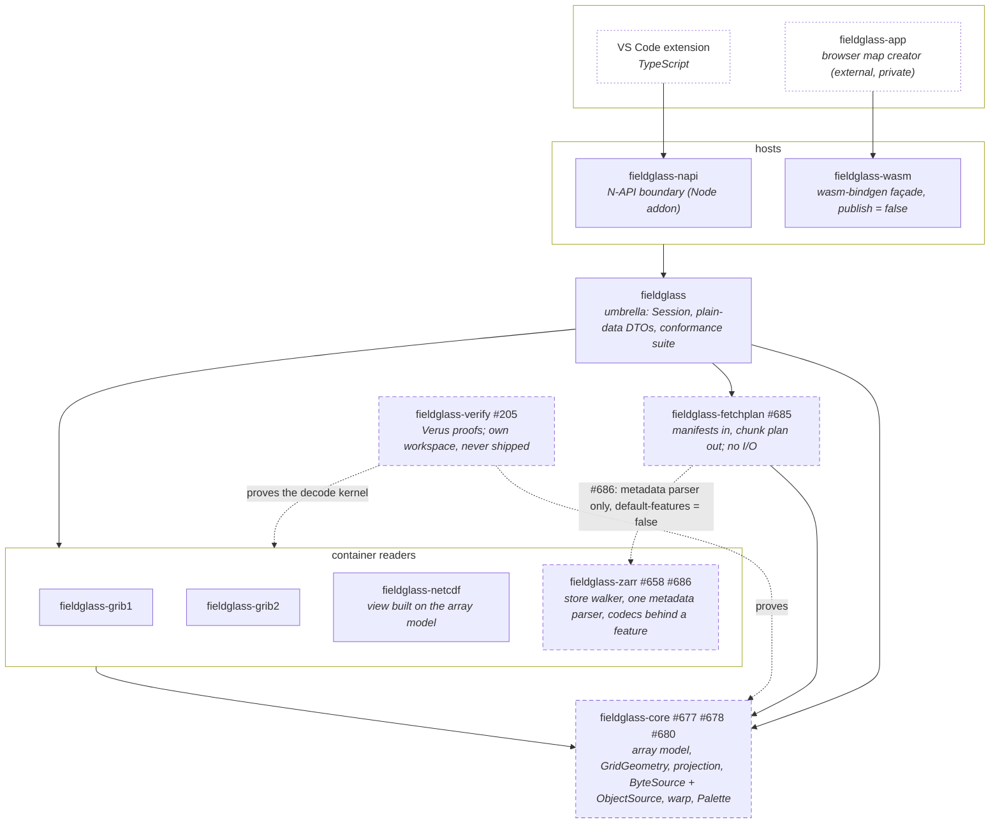

# Planned — Level 1: crates

After milestones 7, 11, and 12. Compare with [`../01-crates.md`](../01-crates.md).

The workspace is described as layers rather than as a list of crates
([ADR-0010](../../decisions/0010-a-common-array-model-and-containers-as-drivers.md)):
a **model** every container reads into, the **container readers** that do
that reading, a **storage seam** that says where bytes and objects come from,
the **manifest** parsers that say which bytes to ask for, and the **hosts**
that bind one umbrella. The two rules from today's diagram survive unchanged:
no format crate depends on another, and nothing below a host depends on a
host. A third is written down now: a shared layer adds no dependency to a
format crate, so a consumer of `fieldglass-grib2` alone links a GRIB2 reader
and nothing else (ADR-0010 decision 6).

Edges into or out of a box apply to every crate in it: `fieldglass` depends
on all four container readers, on `core`, and on `fetchplan`; each reader
depends on `core` and on no other reader; each host depends on `fieldglass`
only. The one edge that is new in kind is `fetchplan` → `zarr`: it exists for
the metadata parser and takes the crate with its codecs off, which is the same
arrangement as `fieldglass` → `core`.

**What each layer is, and what changes in it**

| Layer | Crate | Issue | What changes |
| --- | --- | --- | --- |
| Model | `fieldglass-core` | #677 | `array::ChunkGrid` and `ChunkKeyEncoding` move here from `fetchplan`, on the ungated parsing surface, with no new dependency. |
| Model | `fieldglass-core` | #678 | Dimension, attribute, array description and group types; the CF unpacking rule stated once. |
| Storage seam | `fieldglass-core` | #680, #681 | `ObjectSource` (get by key, list by prefix, prefetch) beside `ByteSource`; `ByteSource` gains `identity()`. Both shipped. |
| Container reader | `fieldglass-zarr` | #686, #658 | One parser of `.zarray` / `zarr.json` producing the model plus the codec chain; codecs behind a default-on `codecs` feature; the store walker over `ObjectSource`, producing `Addressing::Variables` through `Session`. |
| Container reader | `fieldglass-netcdf` | #684, #682 | `DatasetView` built on the model, and the HDF5 reader reading through `ByteSource` like classic does. Both shipped. |
| Manifests | `fieldglass-fetchplan` | #685, #687 | A `PlanItem` says which chunk or message it is; `Manifest` loses `key()`, the GRIB query moves to `MessageManifest`, `KerchunkRefs` implements `Manifest`; the umbrella re-exports the kerchunk and chunk-grid surface. |
| Umbrella | `fieldglass` | #679 | The Variables addressing mode is under conformance. |
| Hosts | `fieldglass-napi` | #659 | Opens a Zarr store by filling an `ObjectSource` from a directory and handing it to the walker. |
| Proofs | `fieldglass-verify` | #205 | Deliberately outside the workspace so `cargo build`, `cargo deny`, and the six-target cross-compile never see Verus. Already exists (#197); the proofs (#199–#204) are what is planned. |

**Features do not stop at a crate boundary.** `core`'s optional surfaces are
off for a host that cannot use them only if every crate between the host and
`core` says so, which is why `fieldglass` takes `core` with
`default-features = false` and forwards `render` and `analysis` as its own
features (#552), and why `fetchplan` will take `fieldglass-zarr` the same way
(#686). The array model is the counter-case, like `GridGeometry`: it sits in an
always-on module because the readers that take `core` feature-reduced are the
ones that produce it. `fs` is not forwarded by anything; ADR-0005 hands every
host bytes rather than a path, and a CLI (#254) or PyO3 consumer that starts
from a path names `fieldglass-core` itself.

**What does not appear.** HTTP range (#247) and S3 (#252) are still not
crates: per ADR-0005 the host fetches, and after #680 what it fetches into is
an `ObjectSource` for a store or a `ByteSource` for a file. `#114` (multi-GB
files) is the same seam applied to a local file. A `fieldglass-array` crate
does not appear either: the model is a module in `core` until a consumer wants
it without the geometry (ADR-0010 decision 1).
