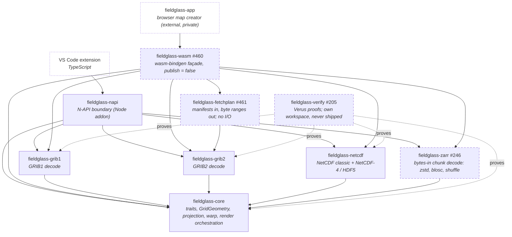

# Planned — Level 1: crates

After milestones 7, 10, and 11. Compare with [`../01-crates.md`](../01-crates.md).

Two hosts instead of one, and two new pure crates below them. The rule from
today's diagram survives unchanged: no format crate depends on another, and
nothing below a host depends on a host. `fieldglass-wasm` is the second
consumer of the format crates and the reason the render orchestration moves
from `napi` into `core` (#464).

**What each new crate is for**

| Crate | Milestone | Depends on | Why it is its own crate |
| --- | --- | --- | --- |
| `fieldglass-wasm` | 11 | format crates, `core`, `fetchplan` | A cdylib for `wasm32-unknown-unknown`; DTO glue only once #464 lands. The host owns memory and fetching. |
| `fieldglass-fetchplan` | 11 | `grib2` (parameter tables for `.idx` vocabulary, #426) | Pure: reads `.idx` / `.index` / Zarr / kerchunk manifests and returns ranges. No I/O, no clock, so it is testable against fixtures and usable from both hosts. |
| `fieldglass-zarr` | 11 (re-scoped) | `core` | Chunk codecs only (zstd via `ruzstd`, blosc, shuffle, v3 shard inner chunks). Addressing lives in `fetchplan`; directory walking is the napi host's concern. |
| `fieldglass-verify` | 7 | `vstd` only; reads the kernel sources | Deliberately outside the workspace so `cargo build`, `cargo deny`, and the six-target cross-compile never see Verus. Already exists (#197); the proofs (#199–#204) are what is planned. |

**What moves.** `core` grows a `GridGeometry` enum and the render
orchestration (`ResolvedOptions`, warp targets, probe, contour and overlay
projection, CSV) that today sit in `napi` (#464). `napi` and `wasm` keep DTOs
and error mapping. That is the one structural change; everything else is
additive.

**What does not appear.** HTTP range (#247) and S3 (#252) are not crates: per
ADR-0005 the host fetches, so in the browser they are `fetch()` with a `Range`
header driven by `fetchplan`'s output, and in the extension they will be the
same call from TypeScript. `#114` (multi-GB files) is the same seam applied to
a local file.
