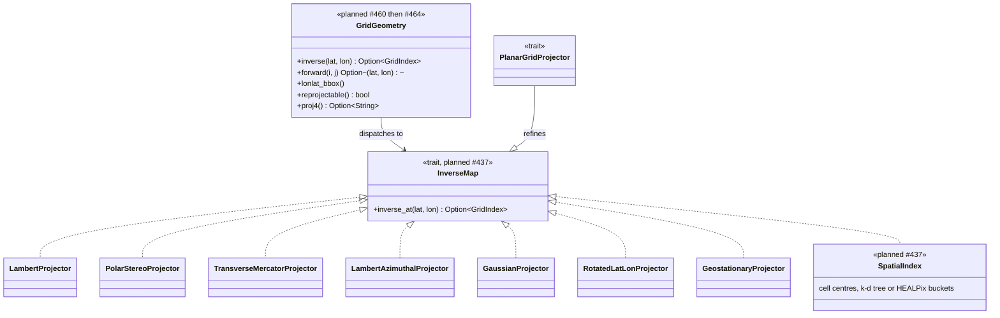
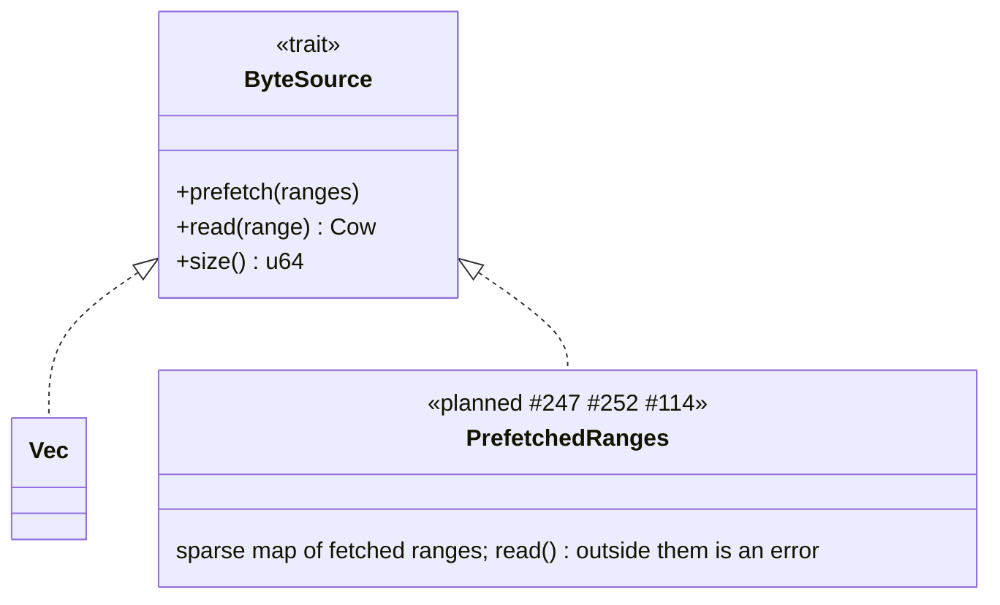
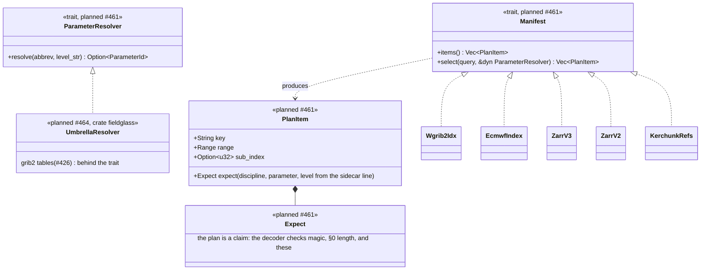
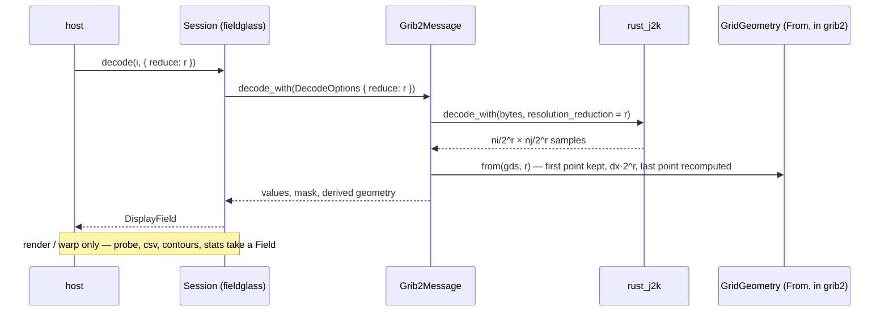
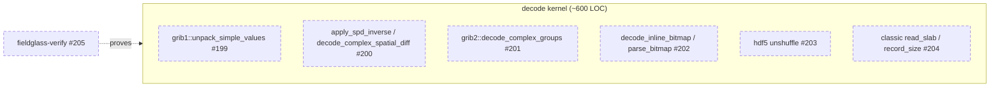

# Planned — Level 2: trait seams

After milestones 7, 10, and 11. Compare with [`../02-trait-seams.md`](../02-trait-seams.md).
Only the seams that change are drawn; `FormatReader` / `DataMessage`,
`Grib1Packing`, and the `TargetProjection` / `PreparedTarget` / `ForwardMap`
family are unchanged and stay in the guarded diagram.

## Grid geometry becomes a type, and inverse lookup becomes a seam

Today the nine per-family warp setups live in `napi` and take a flat 65-field
`MessageMeta`. After #460 (which creates it) and #464 (which moves napi onto
it) `core` owns `GridGeometry`, one variant per family,
built straight from the typed GDS, and the inverse map is a seam with two kinds
of implementer: a formula (`PlanarGridProjector`, today) and a lookup
(`SpatialIndex`, #437) for grids that are only a list of cell centres.

The consumers of the lookup seam, in the order they are filed:

| Consumer | Issue | Where the cell centres come from |
| --- | --- | --- |
| NetCDF 2-D coordinate (curvilinear) grids | #445 | CF `coordinates` → two 2-D lat/lon variables |
| HEALPix §3.150 | #442, #443 | `pix2ang` in core; synthesised onto lat/lon at decode, like spectral |
| GRIB2 §3.204 NCEP curvilinear | #418 | lat/lon carried as two extra fields |
| ICON §3.101 unstructured | #420, #419 | out-of-band grid file, ADR pending |

Lat/lon and Mercator have closed-form inverses as functions today
(`latlon_inverse`, `mercator_inverse`), not projector structs; #437 either
wraps them as implementers or `GridGeometry::inverse()` keeps two paths. The
diagram assumes the former. Whether `InverseMap` is a new trait or
`PlanarGridProjector` widened is #437's call; the diagram assumes a new supertrait so the planar projectors keep their
forward maps, which `SpatialIndex` cannot offer.

## Byte access grows its planned implementers

`ByteSource` exists (#438, NetCDF classic migrated). The remote transports are
**not** Rust implementers: ADR-0005 puts fetching in the host. What Rust gains
is a source over ranges the host already fetched.

## Fetch planning is a seam of its own

`fieldglass-fetchplan` (#461) reads a manifest and returns ranges. Every
cloud-native convention is one dialect. The crate is syntax only: matching a
sidecar's `TMP` / `2 m above ground` to a WMO parameter needs the NCEP table
in `fieldglass-grib2` (#426), and that dependency would drag the decoder and
its codecs into a pure planner, so semantic matching is a trait the umbrella
implements. The GRIB dialects ship first; the Zarr
dialects land with the codec crate (#246) so both are tested against the same
fixtures.

## Decode options

#463 adds a `DecodeOptions { resolution_reduction }` to the GRIB2 decode path.
It is not a trait: only 5.40 honours it, the rest return `Unsupported` for a
non-zero value, and a message with a bitmap refuses it. The point of drawing
it is that a reduced field carries a **derived** `GridGeometry`, never the
message's own GDS.

## Presentation is data, not a seam

`Palette` (#485, the painter's LUT + scale rule, extracted as an API type) is
deliberately not a trait: there is one painter, and a GPU host consumes the
painter's table rather than implementing a second colour path. See
[`03-composition.md`](03-composition.md).

## Verification (milestone 7)

Not a runtime seam, but a boundary worth drawing: which functions carry a
Verus proof. The proofs live in `fieldglass-verify`, outside the workspace,
and restate the kernel functions with pre/post-conditions.

