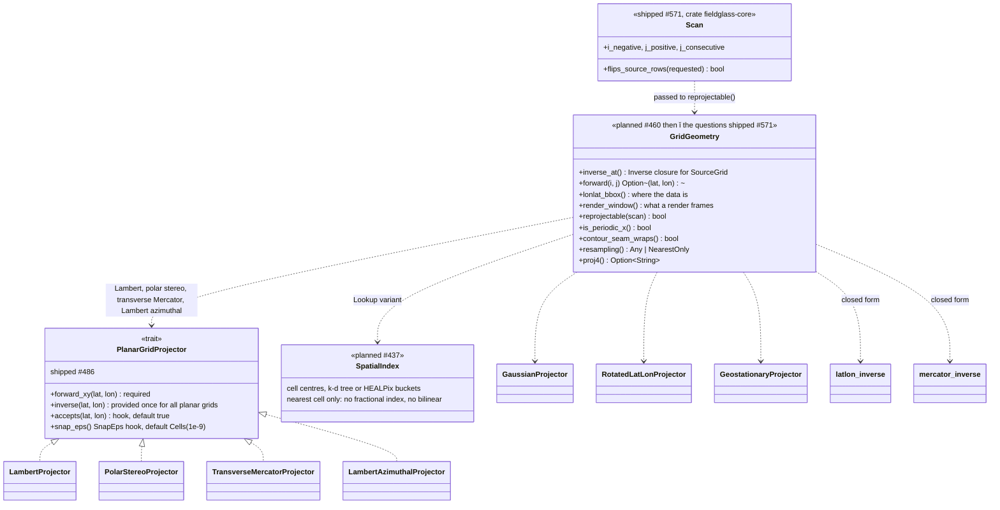
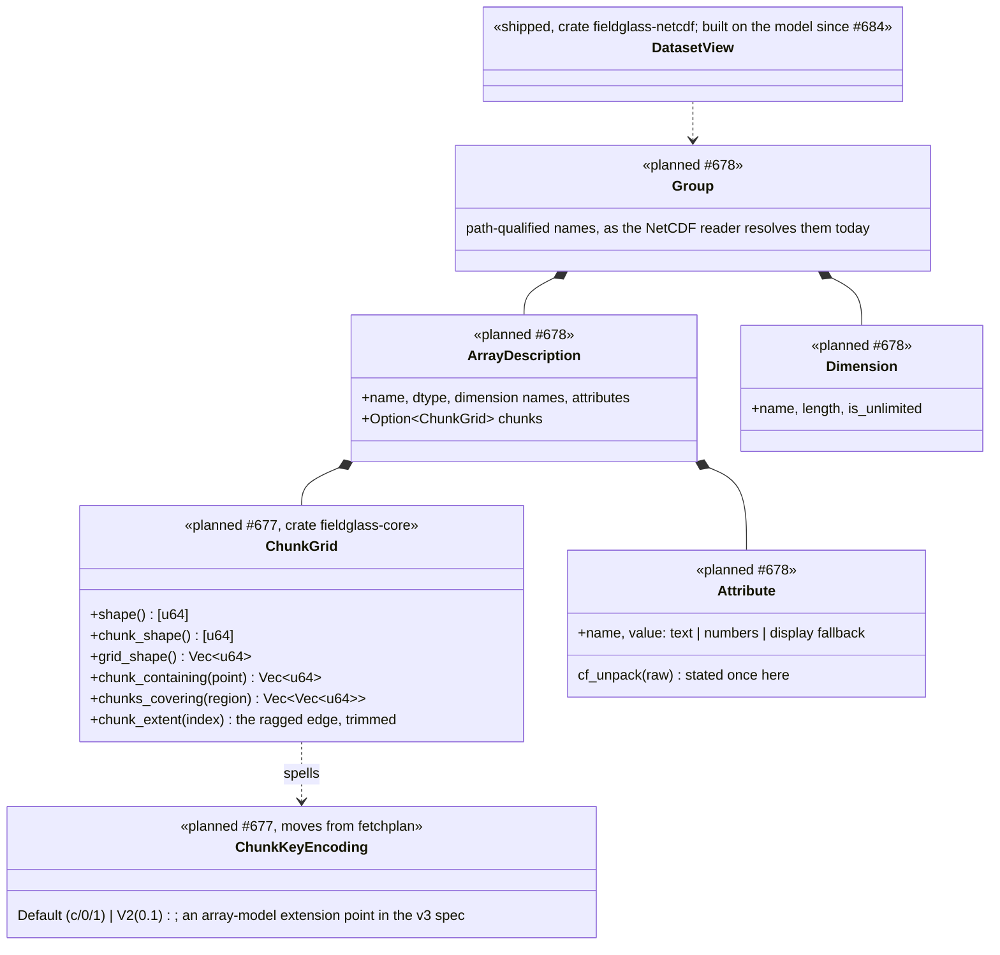
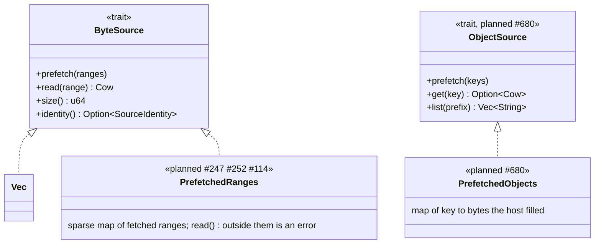
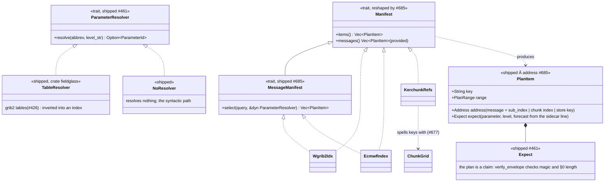
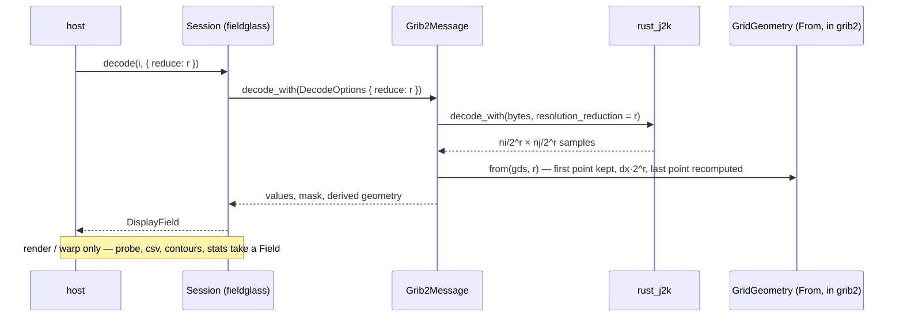
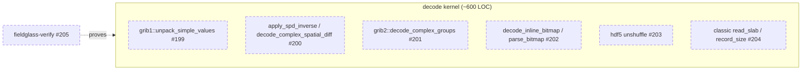

# Planned — Level 2: trait seams

After milestones 7, 10, and 11. Compare with [`../02-trait-seams.md`](../02-trait-seams.md).
Only the seams that change are drawn; `Grib1Packing` and the
`TargetProjection` / `PreparedTarget` / `ForwardMap` family are unchanged and
stay in the guarded diagram.

## Grid geometry becomes a type; the inverse stays a closure

Today the nine per-family warp setups live in `napi` and take a flat 65-field
`MessageMeta`. After #460 (which creates it) and #464 (which moves napi onto
it) `core` owns `GridGeometry`, one variant per family, built straight from
the typed GDS. The seam `warp` consumes is unchanged: `SourceGrid::inverse_at`
is already a closure, so `GridGeometry::inverse_at()` is a `match` per variant
returning that closure, not a new trait. Behind it are two kinds of inverse: a
formula (the projectors, closed-form functions for lat/lon and Mercator) and a
lookup (`SpatialIndex`, #437) for grids that are only a list of cell centres.

Two things this fixes on the way. The four planar `inverse()` bodies were the
same 30 to 50 lines each (guards, forward, `(x − origin) / spacing`, edge
snap); the forward direction was already a provided method on
`PlanarGridProjector`, and the inverse joined it in #486, so the edge-snap rule
exists once. What genuinely differed went into two hooks rather than four
near-copies: `accepts` for a point the projection cannot place at all, and
`snap_eps` for the edge tolerance — `SnapEps::Cells` for a round trip that
closes to float noise, `SnapEps::Metres` for Lambert azimuthal, whose authalic
series carries a real millimetre-scale error, so its tolerance is a property of
the ground rather than of the cell. And `GridIndex` is fractional because the raster grids are: a lookup
grid returns the nearest cell centre, where the fractional part and the
"next column" neighbour mean nothing, so `GridGeometry::Lookup` reports
`NearestOnly` and `warp` refuses or degrades bilinear against it rather than
blending across a tripolar fold.

**The acceptance test for any inverse, formula or lookup, is that a grid places
its own points.** Walk every `(i, j)`, geolocate it, invert it, and get `(i, j)`
back. It needs no external oracle — the grid's own forward map is the answer —
and it is what `.eccodes.ref.json` cannot supply, since that pins only the
forward direction. `crates/fieldglass-core/tests/grid_round_trip.rs` runs it
across all nine families; a new one belongs there the day it is written.

The check existed before that file and still missed two bugs, which is the part
worth remembering: `assert_round_trips` in `projection.rs` had the right shape at
eight call sites, but each built a small synthetic grid, and the polar
stereographic one started at 27°N. It could not have found #488, where a north
polar grid refused everything south of the equator, because no grid it tested
went there. Coverage is a property of the fixture. A lookup grid's version of
the same trap is a tripolar fold or a swath edge that the test grid happens not
to contain — so the fixtures for #444 and #445 should be the awkward ones, not
the convenient ones.

The consumers of the lookup, in the order they are filed:

| Consumer | Issue | Where the cell centres come from |
| --- | --- | --- |
| NetCDF 2-D coordinate (curvilinear) grids | #445 | CF `coordinates` → two 2-D lat/lon variables |
| HEALPix §3.150 | #442, #443 | `pix2ang` in core; synthesised onto lat/lon at decode, like spectral |
| GRIB2 §3.204 NCEP curvilinear | #418 | lat/lon carried as two extra fields |
| ICON §3.101 unstructured | #420, #419 | out-of-band grid file, ADR pending |

## The array model

`fieldglass-core` models grids and nothing above them today. #677 and #678 add
the layer every container that holds named arrays reads into
([ADR-0010](../../decisions/0010-a-common-array-model-and-containers-as-drivers.md)
decision 1): a regular chunk grid with the encoding that spells a chunk's key,
and the dimension, attribute, array-description and group types the NetCDF
view (#684) and the Zarr walker (#658) both produce. It is Zarr v3's array
model, written from the specification and named in Fieldglass's terms, because
that is the model the cloud tools already project every other container onto
(decision 2). None of it is a trait: the readers construct it and `Session`
reads it, the way `GridGeometry` is built by the readers and consumed by
`warp`.

## Byte access grows a keyed sibling

`ByteSource` exists (#438, NetCDF classic migrated). The remote transports are
**not** Rust implementers: ADR-0005 puts fetching in the host. What Rust gains
is a source over ranges the host already fetched, and — with #680 — a source
over *objects* the host already fetched, which is what a Zarr store, a
directory listing and a kerchunk document all are. `ObjectSource` follows the
same rules: a read works whether or not it was prefetched, and everything is
synchronous. The napi host may implement it over `std::fs`, because napi is
the host; a bucket is the browser filling the in-memory one. #681 added the
identity ADR-0005 decision 2 asked for, so the HDF5 memo no longer keys on
length, #682 moved the HDF5 reader onto `ByteSource` the way classic
already was, and #697 moved both GRIB readers. All of it is shipped; what those
migrations settled about windowing and short reads is recorded in the current
[`02-trait-seams.md`](../02-trait-seams.md).

## Fetch planning is manifests in, chunk plan out

`fieldglass-fetchplan` reads a manifest and says where each chunk or message
is. Every cloud-native convention is one dialect. The crate is syntax only:
matching a sidecar's `TMP` / `2 m above ground` to a WMO parameter needs the
NCEP table in `fieldglass-grib2` (#426), and that dependency would drag the
decoder and its codecs into a pure planner, so semantic matching is a trait
the umbrella implements.

The GRIB half landed with #461, the kerchunk half with #660, and the reshape
with #685 (ADR-0010 decision 4); the current
[`02-trait-seams.md`](../02-trait-seams.md) documents all three. The
`Manifest` that shipped first promised one object key per manifest and a
parameter query, and both promises were GRIB's: a reference document addresses
many objects and has nothing to query, which is why `KerchunkRefs` could not
implement it. Now a `PlanItem` carries its own address — a message index with
an optional sub-index, or a chunk index — `Manifest` keeps `items()` and the
provided `messages()`, the query is on a `MessageManifest` extension trait,
and all three dialects share the base trait. The chunk-grid arithmetic the
kerchunk half leans on is `core`'s (#677); kerchunk itself stays, because a
reference document is a manifest. Four things about the GRIB half are facts
rather than plans:

* **No `core` edge, and then one.** The crate was drawn depending on `core`;
  it turned out to need nothing from it *except* the one thing that matters —
  `ByteRange`, the type `ByteSource::prefetch` takes. So a plan range is
  `PlanRange` (`Exact` / `OpenEnded` / `Whole`, because a `.idx` states no
  length) and `PlanRange::close(object_size)` returns `core`'s `ByteRange`.
  Two spellings of one concept was the alternative, and the diagram drift
  guard flagged the name collision before it shipped.
* **`Manifest::messages` is a provided method**, not a per-dialect one:
  collapsing a message's fields onto one fetch is a property of the plan and
  not of the grammar it was read from. It recognises them by address rather
  than by range, so two chunks at the same bytes stay two.
* **`NoResolver` is part of the surface.** Without an implementer that resolves
  nothing, the syntactic path — matching the sidecar's own words, which is what
  a user pasting a `.idx` line has — could not be exercised without the
  umbrella, and the crate would not be testable alone.
* **Ambiguity needs two knobs, not one.** `Query::qualifiers` can only *add*
  requirements, and NBM publishes a plain deterministic field beside its
  probabilistic ones under the same abbreviation and level. `Query::unqualified`
  is how that record is named; without it, it is the one member of an ambiguous
  set nothing can ask for.

## Decode options

#463 adds a `DecodeOptions { resolution_reduction }` to the GRIB2 decode path.
It is not a trait: only 5.40 honours it, the rest return `Unsupported` for a
non-zero value, and a message with a bitmap refuses it. The point of drawing
it is that a reduced field carries a **derived** `GridGeometry`, never the
message's own GDS.

**The decode half of this has landed** (`fieldglass-grib2`,
`Grib2Reader::decode_message_raster_with`), and three things about it are now
facts rather than plans:

* The derived geometry is `GridGeometry::subsampled(r)` in `core`, not a
  `From(gds, r)` in grib2 — it is a question about a grid, and both editions
  will want it. It declines a Gaussian grid, because every other
  Gauss–Legendre node is not the half-order quadrature and there is no
  `GaussianParams` describing the kept rows.
* The refusals are five, not two: any packing but 5.40, a §6 bitmap, a reduced
  grid, alternate-row or `j`-consecutive scanning, and a family with no
  derivable coarse geometry. The two scanning orders are the ones the plan
  missed — both are undone *after* the packing decodes, and a wavelet low-pass
  of a scrambled raster has no undo.
* The "render and warp only" rule is carried by `DisplayRaster`, whose
  `exact_values()` answers `Some` only at reduction zero. `Option`, not a new
  error variant, following #633's precedent: the caller's response to "these
  are not the message's numbers" is to ask again at reduction zero, not to
  branch on a code.

**The host half is not built, and the sequence below is what it would be.**
It turns on a decision nobody has made: `Session::render`, `warp` and `palette`
all take `&Field`, and so do `probe`, `contours` and `combine`. A
`DisplayField` that the first three accept and the last three reject needs
either a sealed trait bound on the render methods — which every binding then
has to monomorphise anyway, since neither wasm-bindgen nor napi crosses a
generic — or a parallel `render_display` / `warp_display` / `palette_display`
on the host surface. ADR-0006 decision 2 ("no generics, lifetimes, or trait
objects") bears on the first and `api_rules.rs` enforces it for types; it says
nothing about method bounds, which is precisely the gap. Until that is settled
the capability is reachable from the format crate and from nothing else.

## Presentation is data, not a seam

`Palette` (#485, the painter's LUT + scale rule, extracted as an API type) is
deliberately not a trait: there is one painter, and a GPU host consumes the
painter's table rather than implementing a second colour path. See
[`03-composition.md`](03-composition.md).

## Verification (milestone 7)

Not a runtime seam, but a boundary worth drawing: which functions carry a
Verus proof. The proofs live in `fieldglass-verify`, outside the workspace,
and restate the kernel functions with pre/post-conditions.

