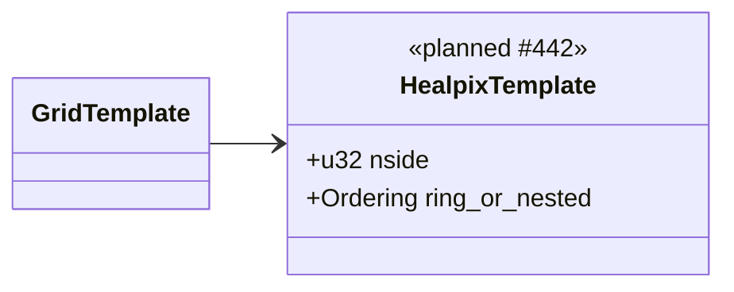
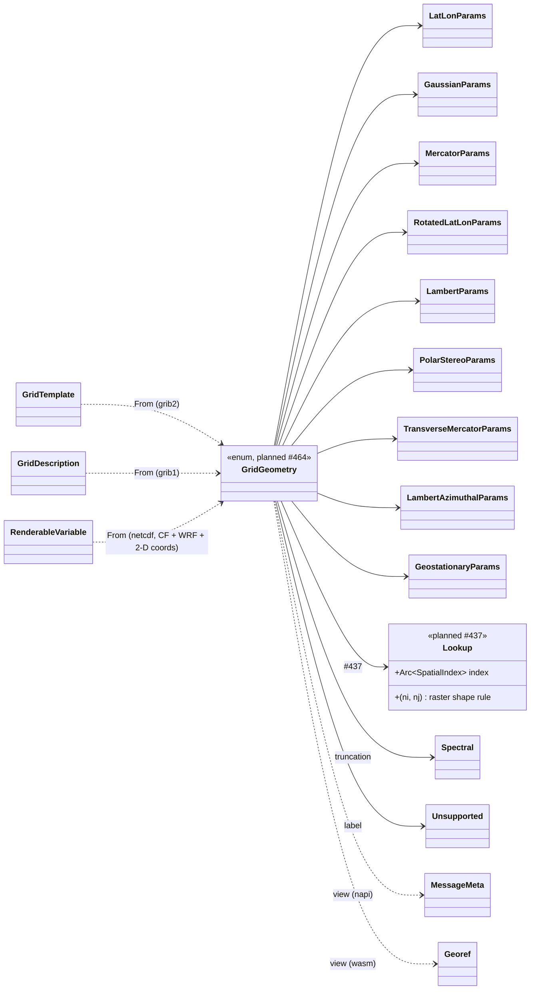
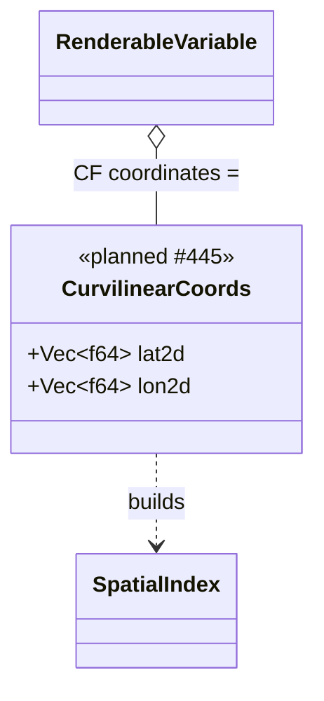
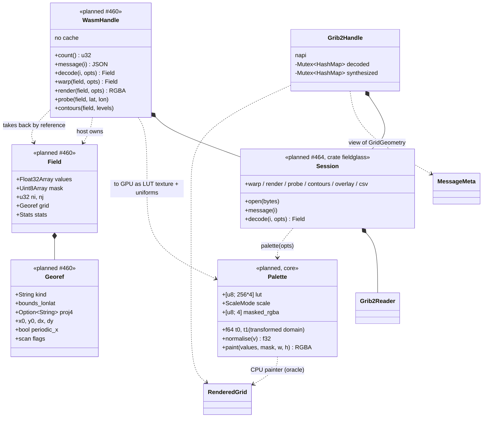

# Planned — Level 3: composition

After milestones 10 and 11. Compare with [`../03-composition.md`](../03-composition.md).
GRIB1 and the NetCDF reader are unchanged except where drawn.

## GRIB2 grid templates gain HEALPix

`GridTemplate` gets one variant (#442). Everything else in the GRIB2 message
is as today.

## Core owns the geometry; `MessageMeta` becomes a view

The centre of #464. Every format's typed grid description converts into one
`GridGeometry`; the hosts' DTOs are built *from* it and nothing in Rust reads
them back.

The synthesised grids (spectral today, HEALPix after #443) keep their pattern:
the decode seam resamples onto a regular lat/lon grid and the field carries a
`GridGeometry::LatLon` for that grid, so probe, contours, CSV, and overlays
need no special case.

## NetCDF: curvilinear grids

#445 adds the third geolocation model alongside ADR-0004's two. The reader
reads the two auxiliary coordinate variables and hands them to the spatial
index; the render pipeline still sees `Vec<Option<f64>>` plus a geometry.

## The two host boundaries after #464

Both hosts bind one `Session` in the `fieldglass` umbrella crate (ADR-0006);
their DTOs are derived from its serde types, and only the buffer handoff is
hand-written. napi keeps its caches (the extension wiggles a picker and
expects a free repaint). wasm keeps none: the host owns every field it
decoded and passes it back for render, probe, and contours, so memory is the
app's decision.

`RenderedGrid` / `TargetRaster` gain caller-controlled `width` × `height` for
the box targets (#465); the default stays the source `ni × nj`.

Colour exists once. `Palette` is what the CPU painter already builds
internally (a 256-entry LUT plus the scale rule), extracted as an API type.
`render()` paints through it, and a GPU host uploads the same table and
applies the same two-line normalisation in a shader snippet the package
ships, so the CPU output is the oracle for the GPU output.
