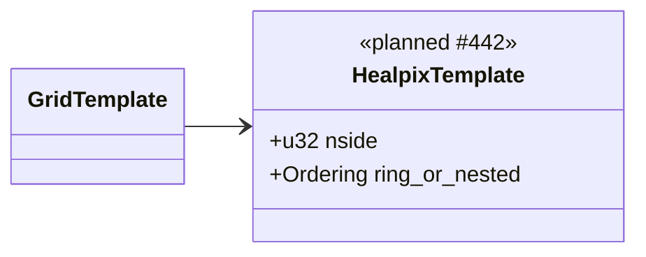
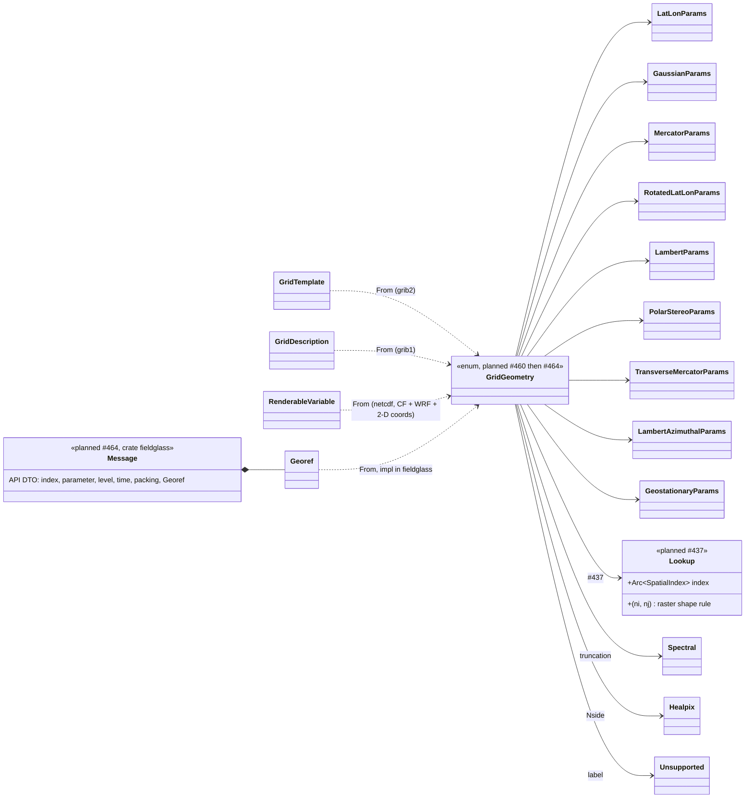
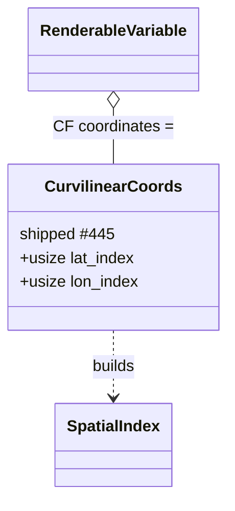
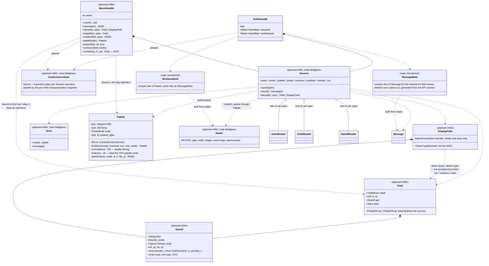

# Planned — Level 3: composition

After milestones 10 and 11. Compare with [`../03-composition.md`](../03-composition.md).
GRIB1 and the NetCDF reader are unchanged except where drawn.

## GRIB2 grid templates gain HEALPix

`GridTemplate` gets one variant (#442). Everything else in the GRIB2 message
is as today.

## Core owns the geometry; `MessageMeta` becomes a view

The centre of #464. Every format's typed grid description converts into one
`GridGeometry`. The `fieldglass` umbrella builds **one** API view of it,
`Georef`, inside `Message`; hosts derive their own types from the API DTOs,
never from core, and nothing in Rust reads a DTO back. Dependencies only
point down: core knows no DTO, `fieldglass` knows no host.

The synthesised grids (spectral and HEALPix, both shipped) keep their pattern:
the decode seam resamples onto a regular lat/lon grid and the field carries a
`GridGeometry::LatLon` for that grid, so probe, contours, CSV, and overlays
need no special case. `Session::decode` does this as of #580, through the
format readers' `synthesis_grid` / `synthesize_message_global`, so which
families need it and what grid each lands on is stated once rather than per
host.

That grid is the one thing downstream may *align* on — `spectral_render_dims`
ignores the truncation, so two spectral fields at different truncations land on
the same raster and genuinely do combine, while two HEALPix fields at different
`Nside` do not. But it is not the size the file states, and a message view that
reported only the synthesised raster would be describing Fieldglass rather than
the data. So the native size survives beside it: a `Healpix` variant carrying
`Nside` alongside the `Spectral` variant already carrying its truncation, which
is what `GridDefinition::size_label` reads today and what `Georef` derives from
after #464 (#416).

Neither variant exists yet, and #580 did not need them: it moved only where the
*decoded field* sits, and the native size still travels as
`MessageInfo::size_label` (`T63`, `Nside 4`) with the declared grid arriving as
`Unsupported { label }`. So the variants stay owed by #464's `Georef`
derivation, which is where the message view stops being able to read a string —
not by the decode seam, which is done.

Reduced Gaussian is the same question with the answer the other way round, and
it constrains the conversion rather than the view: `GaussianParams::ni` is a
plain `u32`, so the variant as drawn can only hold a *regular* grid, while the
rows of a reduced one differ in width. Converting one means choosing what `ni`
means, and both readers now answer the same way: the widest row, because that is
the raster they expand into (#503). The eastern corner that travels with it is
derived from that width rather than read from the message — an octahedral grid
declares `lo2` from the narrower `4N` reference grid, so the file's own value
does not describe the raster. **That derivation lives in the format crates**
(`GridDescription::raster_bounds` / `GridDefinitionSection::raster_bounds`,
beside `dimensions()`, and `decode_message_raster` for the values that go in
it), so `GridGeometry::from` and the napi render seam both read it rather than
each deriving it again (#543). A `GridGeometry::Gaussian` built from `lo2` at
face value would misplace every octahedral grid by up to an eighth of a cell.
The grid's own name (`N32`, `O32`, and `F32` for the regular case eccodes also
names) is not recoverable from `ni` and `nj`, so it travels beside them the way
`Nside` does (#500).

The family tag is the other thing the conversion loses. Both readers report
`reduced_gaussian`, which is what eccodes calls `reduced_gg` and what the
message table shows; `GridGeometry::kind` answers `"gaussian"` for the variant
that holds it. So for a while the two hosts disagreed in public: the extension's
grid-type column said `reduced_gaussian` and the umbrella — and therefore the
browser host — said `gaussian` (#503, #645).

**Settled in #645: the format crate owns the name and both hosts read it, the
way #543 settled the octahedral half of the same hand-off.** `GridGeometry` is
unchanged. Its variants describe *how points are placed*, and after the row
expansion a reduced grid's points are placed exactly as its regular sibling's
are, so `kind` — which is the serde tag and must stay the variant's own name —
stays `"gaussian"`. The declared family is not geometry but message metadata, so
it travels as `Georef::label`, set by `Georef::from_declared` from
`GridDescription::grid_type_name` / `GridDefinitionSection::template_name`
rather than re-derived from the collapsed geometry. A `reduced_gg` message is
now `kind` `gaussian`, `label` `reduced_gaussian` in both hosts, and the
conformance suite carries a reduced-Gaussian subject, which pins the pair for
the runners that drive `Op::Message`. That is a weaker guarantee than it looks
for the browser host, which serialises `Georef` verbatim and so cannot diverge
from the umbrella by construction; the independent check is `fieldglass-napi`'s
own `declared_grid_family_tests`, which compares the two seams on the same bytes
over every committed fixture, because this crate's conformance runner drives
only `Op::Decode` and `Op::Render` and `DecodedGrid` carries no georef.

The three options this document previously listed were each rejected for a
reason worth keeping:

* **Widen the variant.** A `ReducedGaussian` arm would carry the same
  `GaussianParams` and behave identically in every projection path, so it is a
  duplicate arm at the 32 places the workspace names `GridGeometry::Gaussian`,
  with nothing to distinguish it —
  and `GridDescription::scanning_mode` already records what happens next
  ("every consumer that has done so has ended up with an arm list that quietly
  omits a grid family").
* **A reduced flag beside `ni`.** `LatLonParams` is built at 74 sites — the
  global grid, the warp, the overlay, NetCDF, the synthesised rasters — where
  "reduced" means nothing and the flag would be `false`; it would add
  `"reduced": false` to the serialised form of every lat/lon and Gaussian grid;
  and since `kind` must equal the serde tag, the flag alone still would not make
  the hosts agree.
* **Let the grid-type column stop distinguishing them.** That reverses #503, a
  shipped and CHANGELOG-recorded decision that named the two apart on the
  grounds that they are not the same grid, and it loses information from a
  column a user reads.

`label` was already the more specific of the two for a family this build does
not place points on — `spherical_harmonic`, `healpix`, `unsupported(3.99)`, all
of `kind` `unsupported` — so the reduced pair joins an existing split rather
than opening a new one. The same change deleted a second copy of the
family-name list in `fieldglass-grib2/src/geometry.rs`, which had drifted from
`template_name` and dropped the template number from an unmodelled family's
label.

## NetCDF: curvilinear grids

**Shipped in #445.** The third geolocation model alongside ADR-0004's two. The
reader resolves the CF `coordinates` attribute to two auxiliary coordinate
variables and hands them to the spatial index; the render pipeline still sees
`Vec<Option<f64>>` plus a geometry.

`CurvilinearCoords` carries decode indices, not the arrays: a `DatasetView` is
metadata, and the planes are wanted once per slice by the render seam alone. The
index itself is cached on the handle by the *coordinate pair* rather than by the
field, because one file's fields share one mesh.

Two things the conversion has to keep. A `coordinates` attribute may name more
than the pair — RTOFS writes `"Longitude Latitude Date"` — so names are resolved
and kept only if they are 2-D over exactly the dimensions being drawn. And a 2-D
coordinate may legitimately be masked where a 1-D axis may not: a swath granule
marks the fields of view that saw no Earth, so a fill there is data rather than
corruption, and the index keeps such a cell in place without ever returning it.

## The two host boundaries after #464

Both hosts bind one `Session` in the `fieldglass` umbrella crate (ADR-0006);
their DTOs are derived from its serde types (napi's `native.ts` is generated
from the JSON schema), only the buffer handoff and the error mapping are
hand-written, and both run the crate's conformance suite. wasm returns the
API `Message` as-is. napi keeps `MessageMeta` only as a compatibility mapping
from `Message` while the extension still uses its field names; it is a napi
detail, not something `fieldglass` or `core` knows about. napi keeps its caches (the extension wiggles a picker and
expects a free repaint). wasm keeps none: the host owns every field it
decoded and passes it back for render, probe, and contours, so memory is the
app's decision.

`RenderedGrid` / `TargetRaster` gain caller-controlled `width` × `height` for
the box targets (#465); the default stays the source `ni × nj`.

Colour exists once. `Palette` is what the CPU painter already builds
internally (a 256-entry LUT plus the scale rule), extracted as an API type.
`render()` paints through it, and a GPU host uploads the same table and
applies the same two-line normalisation in a shader snippet the package
ships, so the CPU output is the oracle for the GPU output.
