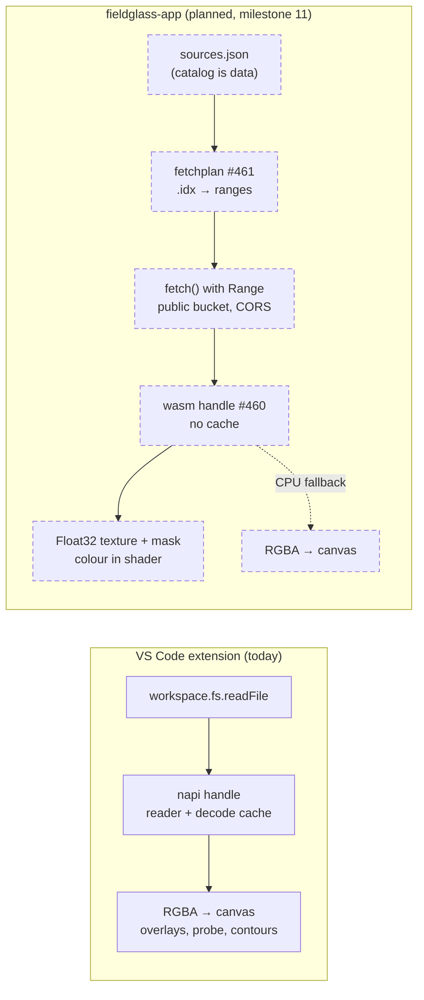
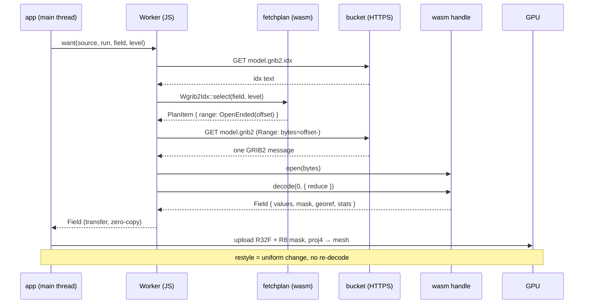

# Planned — Level 4: hosts

New altitude. The guarded diagrams stop at the N-API boundary because there is
one host. Milestone 11 adds a second, and the interesting design is in what
each host does *around* the Rust, not inside it.

## Who does what

ADR-0005 fixes the split: the host fetches and owns memory; Rust is a pure
function of bytes. Both hosts follow it, but they differ in what they cache
and in how a file arrives.

## One field, from a bucket to a texture

The sequence the browser runs for a single GRIB2 message. Every arrow into
Rust is synchronous; every network wait is in the Worker's JavaScript.

Notes that shape the two hosts:

- **Memory.** wasm linear memory never shrinks. The façade therefore holds no
  decode cache; the app decides which `Field`s to keep for an animation and
  drops the rest. napi keeps its caches because the extension's repaint loop
  depends on them.
- **Failure.** The wasm crate builds with `panic = "abort"`, so a decoder
  panic ends the Worker. The app treats the Worker as disposable and restarts
  it; the fuzz targets keep that rare.
- **Sizing.** Until #465 the warp output is the source `ni × nj`; after it the
  app asks for a window at a pixel size, which is what a map view needs.
- **Zoom.** For 5.40 (JPEG 2000) fields #463 lets the app decode at a lower
  wavelet level when the view is coarser than the grid; the returned georef is
  derived, not the message's GDS.
- **The extension later.** "Open URL…" in VS Code (#247) is the same
  `fetchplan` call from TypeScript with `fetch()` in the extension host, then
  the existing napi path. Nothing new in Rust.
