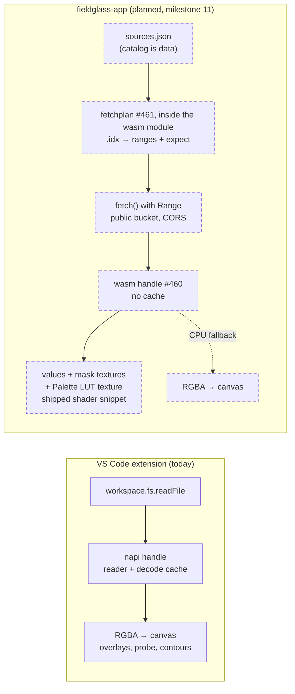
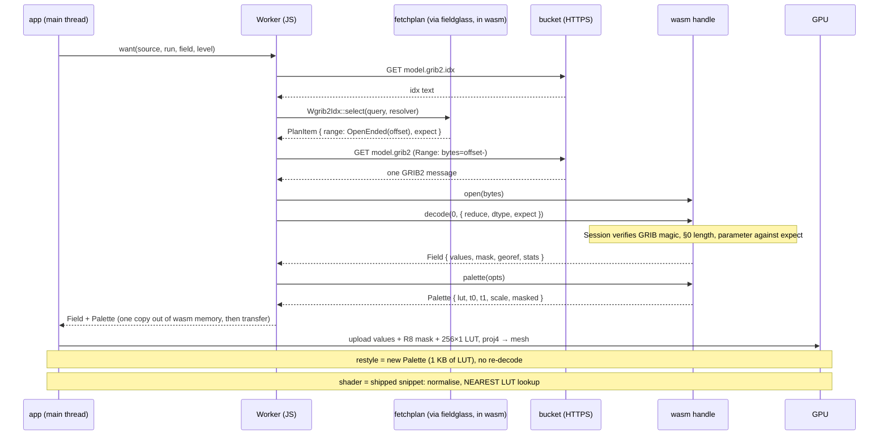

# Planned — Level 4: hosts

New altitude. The guarded diagrams stop at the N-API boundary because there is
one host. Milestone 11 adds a second, and the interesting design is in what
each host does *around* the Rust, not inside it.

## Who does what

ADR-0005 fixes the split: the host fetches and owns memory; Rust is a pure
function of bytes. ADR-0006 fixes what a host *is*: a binding over
`fieldglass::Session` that hand-writes only the buffer handoff and the error
mapping. Both hosts follow both, but they differ in what they cache and in
how a file arrives.

## One field, from a bucket to a texture

The sequence the browser runs for a single GRIB2 message. Every arrow into
Rust is synchronous; every network wait is in the Worker's JavaScript.

Notes that shape the two hosts:

- **Memory.** wasm linear memory never shrinks. The façade therefore holds no
  decode cache; the app decides which `Field`s to keep for an animation and
  drops the rest. napi keeps its caches because the extension's repaint loop
  depends on them.
- **Failure.** The wasm crate builds with `panic = "abort"`, so a decoder
  panic ends the Worker. The app treats the Worker as disposable and restarts
  it; the fuzz targets keep that rare.
- **Sizing.** `warp` outputs the source `ni × nj` unless the caller names a
  `width` × `height`, which is what a map view needs (#465). The render options
  carry the same pair for the two lat/lon-box targets, where the *unnamed*
  default is not `ni × nj` but that shape raised to a 720-pixel long edge (#514),
  or the window's shape for a coordinate-lookup grid (#515). There the size also
  reaches the overlay and contour projections and the pixel probe, so a host that
  sets it for one must set it for all of them.
- **Zoom.** For 5.40 (JPEG 2000) fields #463 lets the app decode at a lower
  wavelet level when the view is coarser than the grid; the returned georef is
  derived, not the message's GDS, and the field is display-only: probe, CSV,
  contours, and stats always use the full-resolution decode. The decode itself
  exists (`Grib2Reader::decode_message_raster_with`; 39.9 ms → 10.5 ms → 2.8 ms
  on the committed 451×337 RAP fixture at reduction 0 / 1 / 2), but no host
  reaches it yet — see the decision recorded under *Decode options* in
  [`02-trait-seams.md`](02-trait-seams.md).
- **Precision.** `Field.values` is f64 unless the packing provably fits f32;
  the R32F texture upload is a downcast the app asks for explicitly.
- **Colour.** Decided once, in Rust: `Palette` feeds both the CPU painter
  and the GPU lookup, and the app's `readPixels` is tested against `render()`.
  The tolerance is one LUT entry, not zero: `Palette::normalise` narrows to
  `f32` and that moves the index for about six positions in a million against
  `Palette::index`, the exact byte the painter emits.
  **That bound holds only if the shader is handed a rebased domain.** A shader
  that subtracts and divides raw `f32` values against raw `f32` bounds loses the
  domain, not just the last bit: once the `f32` gap at `t0` passes one lookup
  step — about `t1 - t0 < 255 · |t0| · 2⁻²³` — the error is unbounded within the
  ramp, measured at 127 entries for a manual range of 1.0 over values near
  `1e7`. Geopotential in m²/s², pressure in Pa and radiances all reach that
  regime under a tight manual range, so the app uploads `v − t0` and the
  cancellation stays in `f64`. `t0`/`t1` are `f64` for this reason. Both the
  bound and the breakdown are pinned by
  `crates/fieldglass-core/tests/palette_golden.rs`.
- **Trust.** A `.idx` range is a claim; the decoder checks the fetched bytes
  against it (magic, length, parameter) and errors on a mismatch.
- **The extension later.** "Open URL…" in VS Code (#247) is the same
  `fetchplan` call from TypeScript with `fetch()` in the extension host, then
  the existing napi path. Nothing new in Rust.
- **Other hosts.** PyO3 (numpy for the three buffers), a CLI and MCP surface
  (`serde_json` of the same DTOs, #254), and a C ABI (`#[repr(C)]` on types
  that already qualify) are each one more binding of `Session`, not a new
  layer in this diagram.
